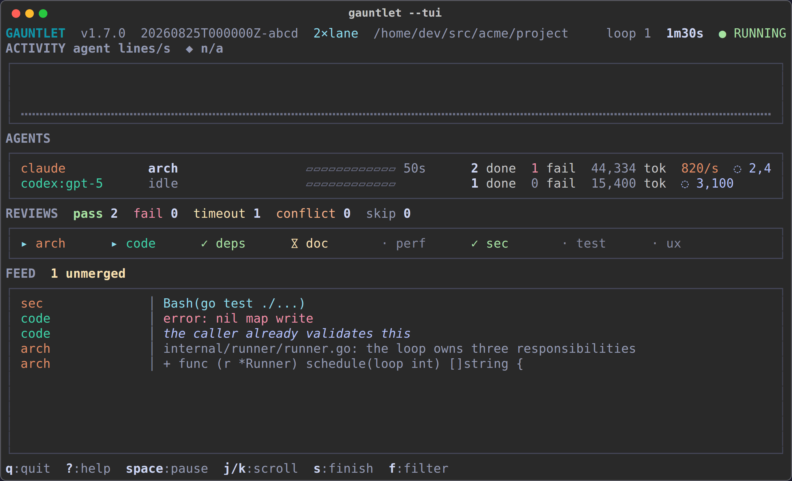
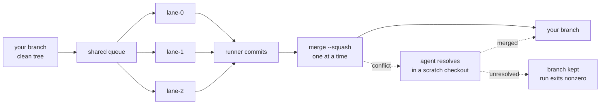
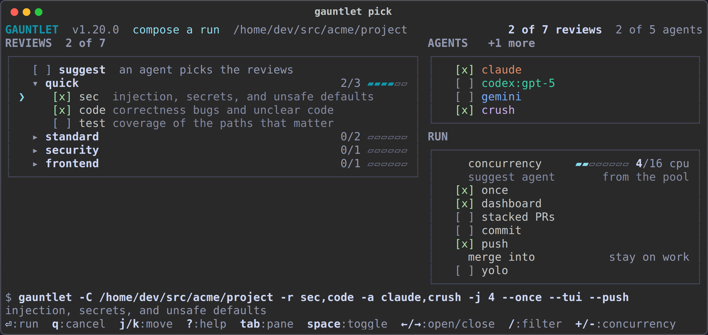

<p align="center">
  <picture>
    <source media="(prefers-color-scheme: dark)" srcset="assets/logo-dark.svg">
    
  </picture>
</p>

<p align="center">
  <em>Run your codebase through the gauntlet: ~50 specialized review prompts,
  dispatched to whichever AI coding agents you have installed, applying fixes
  directly to the working tree.</em>
</p>

<p align="center">
  <a href="https://github.com/maci0/gauntlet/actions/workflows/ci.yml"></a>
  <a href="https://github.com/maci0/gauntlet/releases/latest"></a>
  <a href="LICENSE"></a>
  
  
</p>

<p align="center">
  
</p>

One static binary loops ~50 review prompts over your repository, hands each one
to an agent CLI you already have installed, and applies what it finds.

- **Isolation when it runs in parallel.** `--jobs N` gives N persistent lane
  worktrees that pull reviews from a shared queue, each review on its own
  branch, merged back one at a time. Concurrent agents never share a working
  tree.
- **Unmerged review stacks.** `--stacked-prs` runs reviews in one isolated
  worktree and opens each changed review as a child PR of the previous one.
  The branch in your editor is never changed.
- **Many repositories at once.** `--dirs a,b,c` reviews several trees, each
  with its own lock, baseline, and lane. `--jobs` applies within each.
- **A dashboard.** `--tui` puts lanes, throughput, the review grid, and a
  normalized feed on one screen.
- **Readable output.** Spinner frames, escape sequences, repainted progress
  lines, tool gutters, and duplicate narration are collapsed rather than
  echoed, per agent.
- **Measured, never guessed.** Token counts come from what the agent prints,
  its session transcript, and its machine-readable mode; an agent that reports
  nothing shows no rate.
- **A record.** Every run is JSONL under `~/.gauntlet`, replayable with
  `gauntlet show`.
- **Self-updating, hot-reloading.** A running loop takes a new binary between
  reviews without losing its counters.

## Quick start

Check which installed agents gauntlet can use, then compose a run:

```sh
gauntlet doctor
gauntlet pick
```

Run one isolated, unmerged PR stack from `main`:

```sh
gauntlet -r quick --stacked-prs --pr-base main
```

Everything below is detail: installation, execution modes, and references.

## Install

Install the latest release binary:

```sh
mkdir -p ~/.local/bin
ver=$(curl -fsSL https://api.github.com/repos/maci0/gauntlet/releases/latest | sed -n 's/.*"tag_name": *"v\([^"]*\)".*/\1/p')
curl -fsSL "https://github.com/maci0/gauntlet/releases/download/v${ver}/gauntlet_${ver}_$(uname -s | tr A-Z a-z)_$(uname -m | sed -e s/x86_64/amd64/ -e s/aarch64/arm64/)" -o ~/.local/bin/gauntlet
chmod +x ~/.local/bin/gauntlet
```

`~/.local/bin` must be on `PATH`. Most Linux environments already put it
there; on macOS, add it.

Or build and install from source:

```sh
make install
```

Check or update the installation:

```sh
gauntlet doctor
gauntlet update
```

Upgrading from the Python version: the flags are the same, `--target-dirs` is
still accepted, and `pip`/`uv` are no longer involved. Uninstall the old one
with `uv tool uninstall gauntlet-review` (or `pipx uninstall gauntlet-review`).

Linux and macOS. The runner leans on POSIX semantics that Windows has no
equivalent for: process groups to kill an agent's whole tree on timeout,
`flock` for the directory lock, `O_NOFOLLOW` for prompt reads, and `execve`
for hot reload.

Supported agents: `claude`, `codex`, `gemini`, `qwen`, `grok`, `agy`,
`cursor-agent`, `kimi`, `opencode`, `crush`, `clanker`, `dsh`, plus the pi family
(`pi`, `prime-agent`, `feynman`, `omp`), which ships as editable definitions
rather than code. At least one must be on `PATH`.

Any other agent can be added without a new binary: `--agent-cmd` for one run,
`~/.gauntlet/agents.json` to keep it. `gauntlet doctor` lists every agent it
knows, defined ones included. See
[docs/CLI.md](docs/CLI.md#defining-an-agent-gauntlet-does-not-ship).

## The reviews

Every review is one prompt file. Run all of them, a named set (`-r quick`,
`-r security`, `-r backend`, `-r frontend`, `-r shipping`, `-r agents`), or any
list you like. `gauntlet --list` prints this table with what is scheduled.

<!-- BEGIN REVIEWS: generated from internal/prompt/prompts, checked by TestReadmeGridMatchesBundled -->
| Review | Finds |
| --- | --- |
| `a11y-review` | keyboard, screen readers, contrast, motion, WCAG 2.2 AA |
| `agentrules-review` | the CLAUDE.md and AGENTS.md files every session pays for |
| `api-review` | REST, GraphQL, and gRPC surfaces: consistency, correctness |
| `arch-review` | module boundaries, dependency direction, layering |
| `authz-review` | IDOR, unprotected admin routes, cross-tenant leakage |
| `build-review` | reproducible, hermetic builds and a pinned toolchain |
| `cache-review` | stale reads, cross-tenant bleed, stampedes, growth |
| `cli-review` | exit codes, stdout vs stderr, piping, --help |
| `code-review` | maintainability, correctness, consistency, simplicity |
| `compat-review` | path separators, bashisms, endianness, musl vs glibc |
| `concurrency-review` | races, deadlocks, and corruption under load |
| `config-review` | precedence, validation, secrets in the wrong place |
| `container-review` | probes, graceful shutdown, image hygiene on Kubernetes |
| `db-review` | schema, queries, migrations, data integrity |
| `deps-review` | necessity, supply-chain risk, maintenance burden |
| `design-review` | tradeoffs, alternatives, data modeling, fit to scale |
| `doc-review` | docs and comments that disagree with the code |
| `dr-review` | what is backed up, and has restore ever been proven |
| `dst-review` | can a single seed replay the whole run byte-for-byte |
| `dx-review` | clone to passing tests without losing an afternoon |
| `error-review` | silent data loss, misleading behavior, cascading failure |
| `functionality-review` | the gap between intended and actual behavior |
| `fuzz-review` | untrusted-input surfaces with no fuzz harness |
| `i18n-review` | translations, locale formatting, layout in other scripts |
| `idempotency-review` | what happens when the operation runs twice |
| `infra-review` | CI/CD, IaC, deployment, environment wiring |
| `lint-review` | linters present, strict enough, and blocking CI |
| `llm-review` | prompt injection, cost, and unvalidated model output |
| `minimalism-review` | prove every line is needed, or delete it |
| `mobile-review` | lifecycle, offline, battery, permissions, store readiness |
| `numerics-review` | money in floats, truncating casts, negative modulo |
| `o11y-review` | logs, metrics, traces, alerts, and whether they connect |
| `perf-review` | algorithms, memory, I/O, startup: measured, not guessed |
| `pkg-review` | deb, rpm, Flatpak, wheels, images: what actually ships |
| `privacy-review` | personal data collected, shared, retained, deleted |
| `prompt-review` | whether these prompts work as instructions to an agent |
| `release-review` | semver honesty, breaking changes, changelog, migration |
| `resource-review` | handles, goroutines, listeners, maps that only grow |
| `sdk-review` | the integrating developer's experience of the surface |
| `sec-review` | exploitable vulnerabilities and missing controls |
| `skills-review` | does the skill fire, teach, and stay cheap when loaded |
| `slop-review` | machine-written noise: dead code, restating comments |
| `specs-review` | requirements and decision records the code contradicts |
| `test-review` | tests that give false confidence or miss real bugs |
| `threat-review` | attack surface, trust boundaries, a living threat model |
| `time-review` | DST, leap days, wall-clock durations, cron that misfires |
| `uislop-review` | the interchangeable generated look, no visual identity |
| `unicode-review` | encodings, NFC/NFD, length in the wrong units |
| `ux-review` | friction and confusion from the user's side |
| `webperf-review` | bytes on the wire, blocking the first paint |
<!-- END REVIEWS -->

## How a run works

Reviews run one at a time against your working tree, forever, until you stop
them. `--jobs N` buys parallelism with isolation instead: N persistent lane
worktrees pull reviews from a shared queue, each review on its own branch,
and the runner (never the agent) commits each one and merges them back one
at a time.

Stack mode is sequential for a different reason: every review must see the
commits below it. From base `main`, changed reviews produce `review-1 → main`,
then `review-2 → review-1`, and so on. The PRs stay open; gauntlet removes only
the scratch checkout. It fetches the remote base without moving your local
branch. If the original checkout has uncommitted files, gauntlet names them
and asks before leaving them out of the review. See
[stacked pull requests](docs/RUNS.md#stacked-pull-requests) for the branch
lifecycle and recovery rules.



`--jobs` counts per directory, so `--dirs a,b,c -j 4` is up to 12 agents at
once. A branch that will not merge is handed to an agent, which resolves it in
a scratch checkout; what it cannot resolve stays on its branch for you
(`--resolve-conflicts=false` skips the attempt). Everything lands
on the branch you are already on; `--merge-into BRANCH` is what carries a
loop's committed work anywhere else. The details, plus the run journal and hot
reload, are in [docs/RUNS.md](docs/RUNS.md).

## Dashboard

`--tui` renders the screen at the top of this page: header, activity chart,
one lane per agent, the full review grid, and the feed. `gauntlet pick`
composes a run before it starts, and shows the command it is building while
you do:

<p align="center">
  
</p>

| Key | Action |
|---|---|
| `q`, `esc` | quit (stops the run, killing what is running) |
| `s` | finish: no new reviews, then commit, publish or merge as configured, and exit |
| `space` | pause the feed; output keeps collecting and reviews keep running |
| `j` / `k` | scroll the feed |
| `f` | narrow the feed to results, errors, and diffs, and back |
| `g` / `G` | jump to oldest / newest |
| `?` | help, and the list of unmerged branches |

Review glyphs: `·` pending, `▸` running, `✓` ok, `✗` fail, `⧖` timeout,
`⑂` merge conflict, `–` skipped, `␘` interrupted.

## Trust model

Agents run with their permission prompts disabled. That is the point of the
tool, and it is why the containment rules exist: prompts are read with
`O_NOFOLLOW` and size-capped, agent binaries resolve on a `PATH` without
cwd-relative entries, git runs with `core.fsmonitor`, `core.hooksPath`,
`diff.external`, and the pager forced empty, untrusted text is stripped of
control and bidi characters before display, and a `flock` on `.gauntlet.lock`
keeps two runs out of one directory.

Reviewing a repository you do not trust still means running it in a container.
The boundaries are drawn one by one in
[docs/THREAT_MODEL.md](docs/THREAT_MODEL.md).

## Token counts

Counts come from what the agent prints, its machine-readable mode
(`--stream`), its own session transcript, and, for the two agents that keep
databases instead (crush, opencode), those. All of it is on in a default
build; `make build TAGS=notoktop` drops transcript reading and `make build
TAGS=` drops the database driver too. `gauntlet doctor` says which build you
have. Per-agent coverage, and the public reading API, are in
[docs/TOKEN_TELEMETRY.md](docs/TOKEN_TELEMETRY.md).

## Documentation

| Page | What is in it |
|---|---|
| [docs/CLI.md](docs/CLI.md) | every flag, environment variable, and exit code; defining your own agent |
| [docs/RUNS.md](docs/RUNS.md) | worktree isolation and merging, the run journal, updating and hot reload |
| [docs/DESIGN.md](docs/DESIGN.md) | architecture, concurrency model, and what each decision costs |
| [docs/TOKEN_TELEMETRY.md](docs/TOKEN_TELEMETRY.md) | where token counts come from, per agent, and the public reading API |
| [docs/THREAT_MODEL.md](docs/THREAT_MODEL.md) | trust boundaries, what is validated where, and what is out of scope |
| [docs/IDEAS.md](docs/IDEAS.md) | things deliberately not built yet, and why |
| [CONTRIBUTING.md](CONTRIBUTING.md) | building, testing, and the checks a pull request runs |

## License

AGPL-3.0-or-later.
