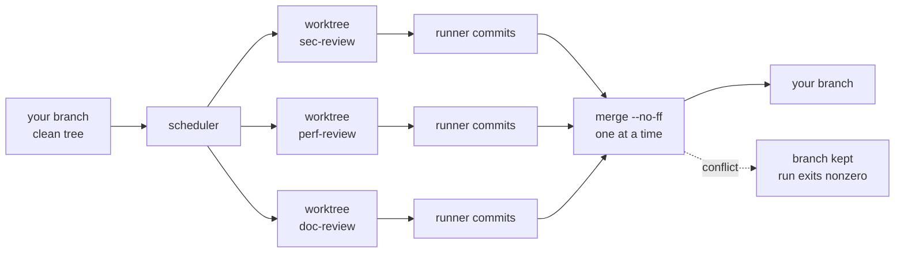

<p align="center">
  <picture>
    <source media="(prefers-color-scheme: dark)" srcset="assets/logo-dark.svg">
    
  </picture>
</p>

<p align="center">
  <em>Run your codebase through the gauntlet: ~50 specialized review prompts,
  dispatched to whichever AI coding agents you have installed, applying fixes
  directly to the working tree.</em>
</p>

<p align="center">
  <a href="https://github.com/maci0/gauntlet/actions/workflows/ci.yml"></a>
  <a href="https://github.com/maci0/gauntlet/releases/latest"></a>
  <a href="LICENSE"></a>
  
  
</p>

```console
$ gauntlet -j 4 -a mixed --tui
GAUNTLET  v1.0.0  20260825T000000Z-abcd  2×worktree  project                loop 1  1m30s  ● RUNNING
ACTIVITY agent lines/s  ◆ n/a
╭──────────────────────────────────────────────────────────────────────────────────────────────────╮
│                                                                                                  │
│ ⣀⣀⣀⣀⣀⣀⣀⣀⣀⣀⣀⣀⣀⣀⣀⣀⣀⣀⣀⣀⣀⣀⣀⣀⣀⣀⣀⣀⣀⣀⣀⣀⣀⣀⣀⣀⣀⣀⣀⣀⣀⣀⣀⣀⣀⣀⣀⣀⣀⣀⣀⣀⣀⣀⣀⣀⣀⣀⣀⣀⣀⣀⣀⣀⣀⣀⣀⣀⣀⣀⣀⣀⣀⣀⣀⣀⣀⣀⣀⣀⣀⣀⣀⣀⣀⣀⣀⣀⣀⣀⣀⣀⣀⣀⣀⣀ │
╰──────────────────────────────────────────────────────────────────────────────────────────────────╯
AGENTS
╭──────────────────────────────────────────────────────────────────────────────────────────────────╮
│ claude           idle                 ▱▱▱▱▱▱▱▱▱▱▱▱          2 done  1 fail  41,234 tok           │
│ codex:gpt-5      code-review          ▰▱▱▱▱▱▱▱▱▱▱▱ 1m30s    0 done  0 fail  1,600 tok  240/s  ◌  │
╰──────────────────────────────────────────────────────────────────────────────────────────────────╯
REVIEWS  pass 1  fail 0  timeout 1  conflict 0  skip 0
╭──────────────────────────────────────────────────────────────────────────────────────────────────╮
│ ▸ code      ⧖ doc       · perf      ✓ sec       · test                                           │
╰──────────────────────────────────────────────────────────────────────────────────────────────────╯
FEED
╭──────────────────────────────────────────────────────────────────────────────────────────────────╮
│ sec-review       │ Bash(go test ./...)                                                           │
│ code-review      │ error: nil map write                                                          │
│ code-review      │ the caller already validates this                                             │
│                                                                                                  │
╰──────────────────────────────────────────────────────────────────────────────────────────────────╯
q:quit  space:pause feed  j/k:scroll  ?:help           41,234 tok  240 tok/s live  ▱▱▱▱▱▱▱▱▱▱ budget
```

As of 1.0 gauntlet is a single Go binary. It replaces the Python implementation
that lived here through 0.26, keeping its prompts, its injected rules, its
containment, and its exit codes, so existing invocations keep working. What the
rewrite adds:

- **Parallel reviews with real isolation.** `--jobs N` gives every review its
  own `git worktree` on its own branch and merges the results back one at a
  time. Concurrent agents never share a working tree.
- **Parallel repositories.** `--dirs a,b,c` reviews several trees at once,
  each with its own lock, baseline, and lane in the output.
- **A dashboard.** `--tui` shows lanes, a live activity chart, the whole
  review grid, and a normalized feed on one screen.
- **Output normalization.** Spinner frames, escape sequences, repainted
  progress lines, tool-output gutters, and duplicate narration are collapsed
  instead of echoed, per agent (claude, codex, and opencode shapes included).
- **Live throughput, and visible reasoning.** Token counts come from three
  sources: what the agent prints, its own session transcript, and its
  machine-readable mode (`--stream`). The dashboard shows a measured tok/s per
  agent, how much of it was reasoning, and a marker while the model is still
  thinking. Agents that report nothing show no rate rather than a guess. Per
  agent coverage is in `docs/TOKEN_TELEMETRY.md`.
- **A run journal.** Every run is recorded as JSONL under `~/.gauntlet`.
- **A self-updating, hot-reloading binary.** `gauntlet update` installs a
  verified release; a running loop notices the new binary and re-executes into
  it between reviews, keeping its counters.
- One static binary with the prompts embedded. No Python, no dependencies.

## Install

```sh
# a release binary (linux/darwin, amd64/arm64)
mkdir -p ~/.local/bin
curl -fsSL https://github.com/maci0/gauntlet/releases/latest/download/gauntlet_$(uname -s | tr A-Z a-z)_$(uname -m | sed -e s/x86_64/amd64/ -e s/aarch64/arm64/) -o ~/.local/bin/gauntlet
chmod +x ~/.local/bin/gauntlet

# or from source
make install            # builds and installs into ~/.local/bin

gauntlet doctor         # check which agent CLIs and helper tools you have
gauntlet update         # replace this binary with the latest verified release
```

Upgrading from the Python version: the flags are the same, `--target-dirs` is
still accepted, and `pip`/`uv` are no longer involved. Uninstall the old one
with `uv tool uninstall gauntlet-review` (or `pipx uninstall gauntlet-review`).

Linux and macOS. The runner leans on POSIX semantics that Windows has no
equivalent for: process groups to kill an agent's whole tree on timeout,
`flock` for the directory lock, `O_NOFOLLOW` for prompt reads, and `execve`
for hot reload.

Supported agents: `claude`, `codex`, `gemini`, `qwen`, `grok`, `agy`,
`cursor-agent`, `kimi`, `opencode`, `clanker`, `dsh`, plus the pi family
(`pi`, `prime-agent`, `feynman`, `omp`), which ships as editable definitions
rather than code. At least one must be on `PATH`.

Any other agent can be added without a new binary, with `--agent-cmd` for one
run or `~/.gauntlet/agents.json` to keep it:

```json
{"myagent": {"argv": ["myagent", "-p", "{prompt}"],
             "stream": ["--mode", "json"],
             "usage": {"roots": ["~/.myagent/sessions"]}}}
```

`gauntlet doctor` lists every agent it knows, defined ones included.

## Quick start

```sh
gauntlet --list                   # every review and set, and what is scheduled
gauntlet --dry-run                # the plan, without running anything
gauntlet -a claude --once         # one pass over everything, then stop
gauntlet -r quick -x test-review  # a named set, minus one review
gauntlet -a mixed                 # sample from every installed agent, forever
gauntlet --suggest --yes          # let an agent pick the relevant reviews
gauntlet --tui                    # same run, live dashboard
```

## Parallel reviews

One agent editing a working tree is safe. Several are not: they overwrite each
other's edits, each one's verification step sees the others' half-applied
changes, and no diff can be attributed afterwards. So parallelism inside one
repository is only granted with isolation:

```sh
gauntlet -j 4 -a mixed --once
```



- Requires git and a **clean working tree** (a branch is cut from a commit, so
  uncommitted work would be invisible to every review).
- Each review gets `git worktree add -b gauntlet/<run>/<review>` under
  `.gauntlet/worktrees/`, excluded from git status via `.git/info/exclude`.
- The runner (never the agent) commits each worktree, then merges the branches
  back into your branch one at a time, `--no-ff`.
- A conflicting merge is **aborted, and its branch is kept**, named after the
  review, so the work can be inspected or merged by hand. Conflicts are
  reported as their own outcome and make the run exit nonzero.
- Merged branches and their checkouts are cleaned up; unmerged ones survive.

Without `--jobs`, reviews run one at a time and edit the tree in place, exactly
like the Python original, dirty tree and all.

## Run journal

Every run is recorded under `~/.gauntlet` (override with `GAUNTLET_HOME`):

```
~/.gauntlet/
  runs/2026-08-25/20260825T131500Z-a91f.jsonl   the full event stream
  index.jsonl                                    one summary line per run
  state/                                         hot-reload handoff files
```

```sh
gauntlet runs --limit 10        # recent runs: when, how long, pass/fail
gauntlet show <run-id>          # replay one run's events
jq 'select(.ev=="review_end")' ~/.gauntlet/runs/*/*.jsonl   # or use your own tools
```

Events are one JSON object per line (`run_start`, `loop_start`,
`review_start`, `review_end`, `merge`, `commit`, `loop_end`, `reload`,
`run_end`, plus runner log lines). Agent output and the live token ticks are
not journaled: they are large and reconstructible, and the results are what
matter later.

## Updating and hot reload

```sh
gauntlet update --check   # what the latest release is
gauntlet update           # download, verify SHA-256, replace this binary
gauntlet --auto-update    # check periodically during a long run
```

The download is verified against the release's `checksums.txt` before it
replaces anything; a mismatch leaves the running binary untouched.

Hot reload is on by default (`--hot-reload=false` disables it). When the
executable on disk changes, by `gauntlet update`, `make install`, or a fresh
`go build`, the swap is seamless:

- **No agent is killed.** Reviews already running finish normally, including
  their commit and merge. Only then does the process hand over.
- **No work is repeated.** The unfinished part of the current loop is handed
  to the successor, which finishes that loop rather than starting it over.
- **Nothing is lost.** Run id, start time, per-review results, per-agent
  totals, and loop budget cross the gap, so the final summary and the journal
  describe the whole run as one. The process keeps its pid and terminal:
  `execve`, not a respawn.

The cost is latency, not correctness: the swap waits for the reviews in flight,
which can take up to `--timeout`.

## Dashboard

`--tui` renders one screen: header, activity chart, one lane per agent, the
full review grid, and the feed.

```
GAUNTLET  v1.0.0  20260825T000000Z-abcd  2×worktree  project                loop 1  1m30s  ● RUNNING
ACTIVITY agent lines/s  ◆ n/a
╭──────────────────────────────────────────────────────────────────────────────────────────────────╮
│                                                                                                  │
│ ⣀⣀⣀⣀⣀⣀⣀⣀⣀⣀⣀⣀⣀⣀⣀⣀⣀⣀⣀⣀⣀⣀⣀⣀⣀⣀⣀⣀⣀⣀⣀⣀⣀⣀⣀⣀⣀⣀⣀⣀⣀⣀⣀⣀⣀⣀⣀⣀⣀⣀⣀⣀⣀⣀⣀⣀⣀⣀⣀⣀⣀⣀⣀⣀⣀⣀⣀⣀⣀⣀⣀⣀⣀⣀⣀⣀⣀⣀⣀⣀⣀⣀⣀⣀⣀⣀⣀⣀⣀⣀⣀⣀⣀⣀⣀⣀ │
╰──────────────────────────────────────────────────────────────────────────────────────────────────╯
AGENTS
╭──────────────────────────────────────────────────────────────────────────────────────────────────╮
│ claude           idle                 ▱▱▱▱▱▱▱▱▱▱▱▱          2 done  1 fail  41,234 tok           │
│ codex:gpt-5      code-review          ▰▱▱▱▱▱▱▱▱▱▱▱ 1m30s    0 done  0 fail  1,600 tok  240/s  ◌  │
╰──────────────────────────────────────────────────────────────────────────────────────────────────╯
REVIEWS  pass 1  fail 0  timeout 1  conflict 0  skip 0
╭──────────────────────────────────────────────────────────────────────────────────────────────────╮
│ ▸ code      ⧖ doc       · perf      ✓ sec       · test                                           │
╰──────────────────────────────────────────────────────────────────────────────────────────────────╯
FEED
╭──────────────────────────────────────────────────────────────────────────────────────────────────╮
│ sec-review       │ Bash(go test ./...)                                                           │
│ code-review      │ error: nil map write                                                          │
│ code-review      │ the caller already validates this                                             │
│                                                                                                  │
╰──────────────────────────────────────────────────────────────────────────────────────────────────╯
q:quit  space:pause feed  j/k:scroll  ?:help           41,234 tok  240 tok/s live  ▱▱▱▱▱▱▱▱▱▱ budget

```

| Key | Action |
|---|---|
| `q`, `esc` | quit (stops the run) |
| `space` | pause the feed; output keeps collecting and reviews keep running |
| `j` / `k` | scroll the feed |
| `g` / `G` | jump to oldest / newest |
| `?` | help, and the list of unmerged branches |

Review glyphs: `·` pending, `▸` running, `✓` ok, `✗` fail, `⧖` timeout,
`⑂` merge conflict, `–` skipped, `␘` interrupted.

## Options

**Choosing reviews**

| Flag | Default | Purpose |
|---|---|---|
| `-r, --reviews LIST` | all | Reviews and/or set names to run. The `-review` suffix is optional (`sec` means `sec-review`). Naming one twice runs it twice per loop. Repeatable. |
| `-x, --exclude LIST` | none | Reviews and/or sets to skip. |
| `-s, --suggest` | off | Shorthand for `--reviews suggest`: an agent inspects the repo and proposes the relevant reviews. |
| `--suggest-agent AGENT` | from `--agents` | Agent to run the suggest step. |
| `--suggest-timeout DUR` | `30m` | Timeout for the suggest step. |
| `--prompt-dir DIR` | bundled | Use `*-review.md` files from DIR instead of the embedded set. |

Sets: `all`, `project`, `quick`, `standard`, `security`, `frontend`,
`backend`, `agents`, `shipping`. A `*-review.md` file in the reviewed tree is
picked up automatically and overrides a bundled prompt of the same name.

**Choosing agents**

| Flag | Default | Purpose |
|---|---|---|
| `-a, --agents LIST` | auto-detect | `tool` or `tool:model` entries; `mixed` means every installed agent. The model id is passed to the CLI verbatim. Repeatable. |
| `--bin TOOL=PATH` | none | Run an agent from a specific executable. Repeatable. |
| `--agent-cmd NAME=ARGV` | none | Define an agent gauntlet does not ship, e.g. `pi='pi -p {prompt}'`. Repeatable; `~/.gauntlet/agents.json` makes it permanent. |
| `--continue-sessions` | off | Resume each agent's session between reviews (reuses context, bleeds context). Ignored in `--jobs` mode. |

**Execution**

| Flag | Default | Purpose |
|---|---|---|
| `-C, --dir DIR` | cwd | Directory to review. |
| `--dirs LIST` | none | Review several directories in parallel; globs are expanded. Conflicts with `--dir`. Also accepted as `--target-dirs`, the name the Python tool used. |
| `-j, --jobs N` | 1 | Reviews at a time; >1 uses worktree isolation and merges back. |
| `-t, --timeout DUR` | `30m` | Per-review timeout (`90s`, `30m`, `1h`, `2d`). |
| `--runtime DUR` | unlimited | Wall-clock budget for the whole run. |
| `-1, --once` | off | One loop, then stop. |
| `-n, --max-loops N` | unlimited | Stop after N loops. |
| `-c, --commit` / `-p, --push` | off | After each review, an agent writes a commit message (no AI attribution) and commits, optionally pushing. |
| `--yolo` | off | Drop the caution rules: no fix count or diff-size limit, public APIs may change. Containment is unaffected. |
| `-y, --yes` | off | Skip the suggest confirmation. |
| `--semcode` | off | Build a semcode index before the loop. |

**Output and modes**

| Flag | Purpose |
|---|---|
| `doctor` | Report installed agent CLIs and helper tools. Exits 1 if no agent is usable. |
| `-l, --list` / `--dry-run` | Show reviews and sets / the planned schedule, then exit. |
| `--show-prompt REVIEW` | Print the exact composed prompt an agent would receive. |
| `--log FILE` | Also write all output to FILE. |
| `-q, --quiet` / `--raw` | Discard agent output / echo it verbatim instead of normalizing. |
| `--stream` | Ask agents for machine-readable output where they support it: live token counts, and the reasoning/output split shown separately in the feed. |
| `--tui` | Live dashboard. |
| `-V, --version` | Print the version. |

## Environment variables

None is required; unset, everything lives under `~/.gauntlet`.

| Variable | Effect |
|---|---|
| `GAUNTLET_HOME` | Root of the state tree instead of `~/.gauntlet`: the run journal, hot-reload handoff files, and `agents.json`. |
| `GITHUB_TOKEN` | Optional. Sent only to api.github.com by `gauntlet update` and `--auto-update`, for a higher API rate limit. |
| `NO_COLOR` | If set at all, no color anywhere. Wins over the two below. |
| `CLICOLOR_FORCE` / `FORCE_COLOR` | Anything but empty or `0`: force color on, so piping through `less -R` keeps its palette. |
| `TERM=dumb` | Disables color unless forced. |

(`GAUNTLET_STATE` exists too, but only within one hot reload: it names the
handoff file passed across the exec.)

## Exit codes

| Code | Meaning |
|---|---|
| 0 | every review ran and passed |
| 1 | a review failed, timed out, was skipped, or would not merge; a commit step failed |
| 2 | usage error |
| 75 | another instance holds the lock for that directory |
| 130 | interrupted |

## Trust model

Agents run with their permission prompts disabled. That is the point of the
tool, and it is why the containment rules exist. Unchanged from the original:

- Prompts are read with `O_NOFOLLOW`, size-capped, regular files only.
- Agent binaries resolve on a `PATH` with cwd-relative entries removed.
- Git runs with `core.fsmonitor`, `core.hooksPath`, `diff.external`, and the
  pager forced empty, so a hostile repository's config cannot execute code.
- Untrusted text (file names, prompt descriptions, agent output) is stripped
  of control and bidi characters before display.
- A `flock` on `.gauntlet.lock` keeps two runs out of one directory.

Reviewing a repository you do not trust still means running it in a container.

## Reading agent throughput from your own tools

The token-reading machinery lives in [toktop](https://github.com/maci0/toktop),
which is where the per-agent archaeology is maintained: where each CLI keeps
its transcript, which counters are cumulative, which field means generated
output. Agents defined in `~/.gauntlet/agents.json` are picked up too.

```go
import "github.com/maci0/toktop/agentusage"

for _, p := range agentusage.Discover() {      // agents running right now
    w := agentusage.Watch(p.Tool, p.Dir, time.Now())
    // w.Read() returns cumulative usage; agentusage.Rate turns two into tok/s
}
```

`Discover` reads `/proc` and so lists processes on Linux only; `Watch`
works wherever the agent's transcripts do.

Gauntlet reads transcripts by default: released binaries, `make build`, and a
plain `go build` all include it. `make build TAGS=notoktop` opts out and
produces a gauntlet with no dependencies outside the standard library, which
reads only the counts agents print themselves. `gauntlet doctor` says which
build you have.

opencode keeps its sessions in SQLite instead, so reading it needs both
`make build TAGS=sqlite` and `--opencode-db`: a database driver is a lot to
link in for one agent, and opening someone's session database should be asked
for.

## Documentation

- `docs/DESIGN.md`: architecture, concurrency model, and what each decision costs.
- `docs/IDEAS.md`: things deliberately not built yet, and why.

## License

AGPL-3.0-or-later, as the original.
