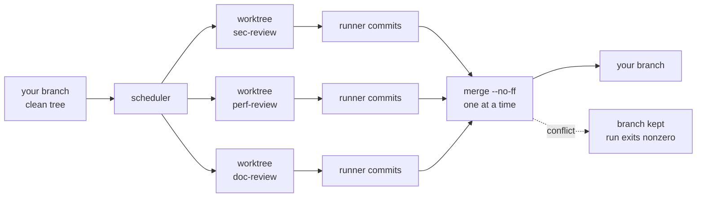

<p align="center">
  <picture>
    <source media="(prefers-color-scheme: dark)" srcset="assets/logo-dark.svg">
    
  </picture>
</p>

<p align="center">
  <em>Run your codebase through the gauntlet: ~50 specialized review prompts,
  dispatched to whichever AI coding agents you have installed, applying fixes
  directly to the working tree.</em>
</p>

<p align="center">
  <a href="https://github.com/maci0/gauntlet/actions/workflows/ci.yml"></a>
  <a href="https://github.com/maci0/gauntlet/releases/latest"></a>
  <a href="LICENSE"></a>
  
  
</p>

```console
$ gauntlet -j 4 -a mixed --tui
GAUNTLET  v1.0.0  20260825T000000Z-abcd  2×worktree  project                loop 1  1m30s  ● RUNNING
ACTIVITY agent lines/s  ◆ n/a
╭──────────────────────────────────────────────────────────────────────────────────────────────────╮
│                                                                                                  │
│ ⣀⣀⣀⣀⣀⣀⣀⣀⣀⣀⣀⣀⣀⣀⣀⣀⣀⣀⣀⣀⣀⣀⣀⣀⣀⣀⣀⣀⣀⣀⣀⣀⣀⣀⣀⣀⣀⣀⣀⣀⣀⣀⣀⣀⣀⣀⣀⣀⣀⣀⣀⣀⣀⣀⣀⣀⣀⣀⣀⣀⣀⣀⣀⣀⣀⣀⣀⣀⣀⣀⣀⣀⣀⣀⣀⣀⣀⣀⣀⣀⣀⣀⣀⣀⣀⣀⣀⣀⣀⣀⣀⣀⣀⣀⣀⣀ │
╰──────────────────────────────────────────────────────────────────────────────────────────────────╯
AGENTS
╭──────────────────────────────────────────────────────────────────────────────────────────────────╮
│ claude           idle                 ▱▱▱▱▱▱▱▱▱▱▱▱          2 done  1 fail  41,234 tok           │
│ codex:gpt-5      code-review          ▰▱▱▱▱▱▱▱▱▱▱▱ 1m30s    0 done  0 fail  1,600 tok  240/s  ◌  │
╰──────────────────────────────────────────────────────────────────────────────────────────────────╯
REVIEWS  pass 1  fail 0  timeout 1  conflict 0  skip 0
╭──────────────────────────────────────────────────────────────────────────────────────────────────╮
│ ▸ code      ⧖ doc       · perf      ✓ sec       · test                                           │
╰──────────────────────────────────────────────────────────────────────────────────────────────────╯
FEED
╭──────────────────────────────────────────────────────────────────────────────────────────────────╮
│ sec-review       │ Bash(go test ./...)                                                           │
│ code-review      │ error: nil map write                                                          │
│ code-review      │ the caller already validates this                                             │
│                                                                                                  │
╰──────────────────────────────────────────────────────────────────────────────────────────────────╯
q:quit  space:pause feed  j/k:scroll  ?:help           41,234 tok  240 tok/s live  ▱▱▱▱▱▱▱▱▱▱ budget
```

One static binary loops ~50 review prompts over your repository, hands each one
to an agent CLI you already have installed, and applies what it finds.

- **Isolation when it runs in parallel.** `--jobs N` gives every review its own
  `git worktree` on its own branch, merged back one at a time. Concurrent
  agents never share a working tree.
- **Many repositories at once.** `--dirs a,b,c` reviews several trees, each
  with its own lock, baseline, and lane. `--jobs` applies within each.
- **A dashboard.** `--tui` puts lanes, throughput, the review grid, and a
  normalized feed on one screen.
- **Readable output.** Spinner frames, escape sequences, repainted progress
  lines, tool gutters, and duplicate narration are collapsed rather than
  echoed, per agent.
- **Measured, never guessed.** Token counts come from what the agent prints,
  its session transcript, and its machine-readable mode; an agent that reports
  nothing shows no rate.
- **A record.** Every run is JSONL under `~/.gauntlet`, replayable with
  `gauntlet show`.
- **Self-updating, hot-reloading.** A running loop takes a new binary between
  reviews without losing its counters.

## Install

```sh
# a release binary (linux/darwin, amd64/arm64)
mkdir -p ~/.local/bin
ver=$(curl -fsSL https://api.github.com/repos/maci0/gauntlet/releases/latest | sed -n 's/.*"tag_name": *"v\([^"]*\)".*/\1/p')
curl -fsSL "https://github.com/maci0/gauntlet/releases/latest/download/gauntlet_${ver}_$(uname -s | tr A-Z a-z)_$(uname -m | sed -e s/x86_64/amd64/ -e s/aarch64/arm64/)" -o ~/.local/bin/gauntlet
chmod +x ~/.local/bin/gauntlet

# or from source
make install            # builds and installs into ~/.local/bin

gauntlet doctor         # check which agent CLIs and helper tools you have
gauntlet update         # replace this binary with the latest verified release
```

Upgrading from the Python version: the flags are the same, `--target-dirs` is
still accepted, and `pip`/`uv` are no longer involved. Uninstall the old one
with `uv tool uninstall gauntlet-review` (or `pipx uninstall gauntlet-review`).

Linux and macOS. The runner leans on POSIX semantics that Windows has no
equivalent for: process groups to kill an agent's whole tree on timeout,
`flock` for the directory lock, `O_NOFOLLOW` for prompt reads, and `execve`
for hot reload.

Supported agents: `claude`, `codex`, `gemini`, `qwen`, `grok`, `agy`,
`cursor-agent`, `kimi`, `opencode`, `clanker`, `dsh`, plus the pi family
(`pi`, `prime-agent`, `feynman`, `omp`), which ships as editable definitions
rather than code. At least one must be on `PATH`.

Any other agent can be added without a new binary: `--agent-cmd` for one run,
`~/.gauntlet/agents.json` to keep it. `gauntlet doctor` lists every agent it
knows, defined ones included. See
[docs/CLI.md](docs/CLI.md#defining-an-agent-gauntlet-does-not-ship).

## Quick start

```sh
gauntlet --list                   # every review and set, and what is scheduled
gauntlet --dry-run                # the plan, without running anything
gauntlet -a claude --once         # one pass over everything, then stop
gauntlet -r quick -x test-review  # a named set, minus one review
gauntlet -a mixed                 # sample from every installed agent, forever
gauntlet --suggest --yes          # let an agent pick the relevant reviews
gauntlet --tui                    # same run, live dashboard
```

## How a run works

Reviews run one at a time against your working tree, forever, until you stop
them. `--jobs N` buys parallelism with isolation instead: every review gets
its own `git worktree` on its own branch, and the runner (never the agent)
commits each one and merges them back one at a time.



`--jobs` counts per directory, so `--dirs a,b,c -j 4` is up to 12 agents at
once. Conflicts abort the merge and keep the branch for you. The details, plus
the run journal and hot reload, are in [docs/RUNS.md](docs/RUNS.md).

## Dashboard

`--tui` renders the screen at the top of this page: header, activity chart,
one lane per agent, the full review grid, and the feed.

| Key | Action |
|---|---|
| `q`, `esc` | quit (stops the run) |
| `space` | pause the feed; output keeps collecting and reviews keep running |
| `j` / `k` | scroll the feed |
| `g` / `G` | jump to oldest / newest |
| `?` | help, and the list of unmerged branches |

Review glyphs: `·` pending, `▸` running, `✓` ok, `✗` fail, `⧖` timeout,
`⑂` merge conflict, `–` skipped, `␘` interrupted.

## Trust model

Agents run with their permission prompts disabled. That is the point of the
tool, and it is why the containment rules exist: prompts are read with
`O_NOFOLLOW` and size-capped, agent binaries resolve on a `PATH` without
cwd-relative entries, git runs with `core.fsmonitor`, `core.hooksPath`,
`diff.external`, and the pager forced empty, untrusted text is stripped of
control and bidi characters before display, and a `flock` on `.gauntlet.lock`
keeps two runs out of one directory.

Reviewing a repository you do not trust still means running it in a container.
The boundaries are drawn one by one in
[docs/THREAT_MODEL.md](docs/THREAT_MODEL.md).

## Token counts

Counts come from what the agent prints, its machine-readable mode
(`--stream`), and its own session transcript, which is read by default and
opts out with `make build TAGS=notoktop`. `gauntlet doctor` says which build
you have. Per-agent coverage, and the public reading API, are in
[docs/TOKEN_TELEMETRY.md](docs/TOKEN_TELEMETRY.md).

## Documentation

| Page | What is in it |
|---|---|
| [docs/CLI.md](docs/CLI.md) | every flag, environment variable, and exit code; defining your own agent |
| [docs/RUNS.md](docs/RUNS.md) | worktree isolation and merging, the run journal, updating and hot reload |
| [docs/DESIGN.md](docs/DESIGN.md) | architecture, concurrency model, and what each decision costs |
| [docs/TOKEN_TELEMETRY.md](docs/TOKEN_TELEMETRY.md) | where token counts come from, per agent, and the public reading API |
| [docs/THREAT_MODEL.md](docs/THREAT_MODEL.md) | trust boundaries, what is validated where, and what is out of scope |
| [docs/IDEAS.md](docs/IDEAS.md) | things deliberately not built yet, and why |

## License

AGPL-3.0-or-later.
