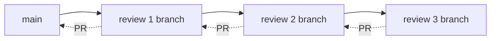

# gauntlet design

The Go implementation of gauntlet: run ~50 specialized review prompts through installed
AI coding agents, which apply fixes directly to the working tree.

The Python original is a single 2700-line sequential script. This port keeps
the original's prompt semantics, and changes five things: reviews can run
in parallel with git-level isolation, agent output is normalized into
structured events instead of raw bytes, every run is journaled, and the binary
can replace and reload itself while a loop is running; an ordered pass can
also publish its changes as a linear, unmerged PR stack.

## Goals

1. Same review semantics as the Python original: same prompts, same injected
   rules, same containment, same exit codes.
2. Parallel where it is safe: across directories always, and inside one
   directory only with isolated lane worktrees and a merge step.
3. A dashboard that reads like an instrument, not a log tail.
4. Fast: sub-100ms to first useful output, no measurable runner overhead
   against agent wall time.
5. One static binary that can update and reload itself.

## Non-goals

- Sandboxing the agents. Containment is prompt-level and process-level
  (new session, no stdin, hard timeout), exactly as in the original. Running
  untrusted repos still means running them in a container.
- Reimplementing agent CLIs. The runner is a scheduler and a screen.

## Package layout

| Package | Responsibility |
|---|---|
| `cmd/gauntlet` | flag parsing, mode dispatch, exit codes |
| `internal/agent` | agent specs, PATH resolution, command construction, doctor inventory |
| `internal/prompt` | embedded prompts, project prompt discovery, sets, composition |
| `internal/normalize` | agent output noise reduction and line classification |
| `internal/gitx` | hardened git invocation, worktree line stats |
| `internal/ghx` | bounded, argv-only GitHub PR discovery and creation through `gh` |
| `internal/runner` | scheduler, worktrees, timeouts, lock, commit step, events |
| `internal/journal` | the JSONL run log under `~/.gauntlet` |
| `internal/gauntlethome` | the one resolver of the state root (`GAUNTLET_HOME`, else `~/.gauntlet`), shared by the journal and agent definitions |
| `internal/streamjson` | envelope-agnostic parser for agents' machine-readable output |
| `internal/ui` | bubbletea dashboard |
| `internal/selfupdate` | release check, verified download, atomic replace, re-exec |
| `internal/humanize` | one formatter for durations and counts, shared by all of them |
| `internal/fuzzy` | typo-tolerant name matching, behind every "did you mean" hint |
| `internal/runner/usage*.go` | the bridge to toktop's transcript reading, on unless `-tags notoktop` |

Dependency direction is strictly downward: `runner` imports `agent`,
`prompt`, `normalize`, `gitx`, `ghx`, `streamjson`, `humanize`, and
`journal`; `ui` imports
`runner`'s event types plus the shared `normalize` line kinds, `humanize`
formatters, and the `fuzzy` fold behind the picker's filter, and nothing
else. `prompt` imports `gitx`, so project discovery's
one git call (check-ignore) uses the same hardened resolver and safe config
as every other git invocation. `agent` and `prompt` import `fuzzy`, so a
mistyped review or agent name gets the same suggestion everywhere.
Nothing imports `ui`, so the loop runs headless with zero TUI cost.

## External dependencies

Seven direct modules and one deliberate transitive; everything else is
standard library. The default is no
new dependency: each row earns its place by doing something the standard
library cannot, and each was kept small on purpose.

| Module | Why it exists | Contained by |
|---|---|---|
| `charmbracelet/bubbletea` | dashboard event loop | imported by `internal/ui` only |
| `charmbracelet/lipgloss` | dashboard styling and adaptive color pairs | imported by `internal/ui` only |
| `muesli/termenv` | color-profile control for `--no-color`; lipgloss v1's profile API takes a termenv profile, so setting it means importing the type | `internal/ui.SetMonochrome` only |
| `maci0/toktop` | transcript token counts for agents that print none | build tag `-tags notoktop` drops it entirely |
| `modernc.org/sqlite` | crush/opencode keep counters in databases, not transcripts | pulled in through toktop; `TAGS=` builds drop it; pure Go, so `CGO_ENABLED=0` cross-compilation is unaffected |
| `rivo/uniseg` | grapheme-cluster width, truncation, and segmentation so CJK and emoji render in alignment | display paths in `internal/ui` and the plain reporter in `cmd/gauntlet` |
| `golang.org/x/text` | NFC normalization under fuzzy matching, prompt-name handling, the picker's filter, and the file-signal suggester | `internal/fuzzy`, `internal/prompt`, `internal/runner`, `internal/ui` |
| `golang.org/x/term` | terminal detection and size before the TUI starts | `cmd/gauntlet` only |

What the hand-rolled packages replace: `humanize`, `streamjson`, and `fuzzy`
exist because a general library for each would cost more in weight and
supply-chain surface than the few hundred lines they stand in for.

Supply-chain posture, and what any new dependency inherits as obligations:

- Every module is pinned to an exact version and verified against `go.sum`
  at build time. GitHub Actions are pinned by commit SHA, not tag.
  Runner images are pinned (`ubuntu-24.04`, `macos-15`), not `-latest`.
- Each release ships `checksums.txt` (the contract `gauntlet update` verifies
  downloads against) and `sbom.txt`, a per-binary module inventory from
  `go version -m`.
- A scheduled `govulncheck` job, plus one on every `go.mod`/`go.sum` change,
  reports vulnerabilities reachable from this code; dependabot owns version
  bumps, the scan owns advisories.
- Licenses are MIT or BSD-3-Clause throughout, compatible with this repo's
  AGPL-3.0-or-later. A dependency's license is checked before adoption,
  not after.
- The sqlite driver tracks upstream SQLite closely; when auditing, read the
  `SQLITE_VERSION` constant in its `lib/sqlite.go`. Gauntlet only runs
  self-constructed queries against agent-owned database files, never SQL
  from untrusted input.
- Major versions of the Charm stack (bubbletea/lipgloss v2, February 2026)
  are adopted through a dedicated migration pass, never a drive-by bump:
  the v2 View API changes wholesale, and the v1 line continues to receive
  fixes in the meantime.

## Concurrency model

Two agents editing one working tree corrupt each other's work: one rewrites a
file the other is mid-way through fixing, one's verification run sees the
other's half-applied change, and neither diff is attributable afterwards. So
the unit of safe parallelism is **the directory**, not the agent.

```
--dirs ~/a ~/b ~/c
    ┌─ worker(~/a) ─ lock ─ sequential loop over reviews ─┐
    ├─ worker(~/b) ─ lock ─ sequential loop over reviews ─┼─► events
    └─ worker(~/c) ─ lock ─ sequential loop over reviews ─┘
```

- One worker per target directory, each with its own `.gauntlet.lock`, git
  baseline, review queue, and lane of the event stream. This is where the
  parallelism lives, and it is always safe: distinct trees, distinct agents.
- Inside one directory, reviews run **one at a time** by default, exactly as
  the Python original does, editing the working tree in place.
- `--jobs N` (N > 1) turns on **isolated parallel reviews**, described below.
- `--stacked-prs` turns on one **isolated sequential stack**, described below.
- A review that fails to launch or exits non-zero is retried on the same
  agent (`--retries`, default 2), then on further agents until the pool is
  exhausted. Timeouts are not retried.
- Cancellation is a `context.Context` per review, plus process-group kill
  (SIGTERM, then SIGKILL after 10s) exactly as the original.
- Events are published on one buffered channel per run and fanned out to the
  logger, the journal, and the TUI. Publishing never blocks the scheduler:
  output and live usage ticks may be dropped when a subscriber's buffer is
  full; results are never dropped.

### Isolated parallel reviews (`--jobs N`)

Concurrent agents in one working tree corrupt each other, so the runner does
not allow it. Parallelism inside a directory is granted only with isolation:
N persistent lane worktrees pull reviews from a shared queue. Each review
still gets its own branch; the lane directory stays put so later reviews in
that lane reuse the agent's prompt cache (see below).

```
baseline commit
   ├── git worktree add  lane-0   .gauntlet/worktrees/…
   ├── git worktree add  lane-1   .gauntlet/worktrees/…
   └── git worktree add  lane-2   .gauntlet/worktrees/…
         N agents run concurrently, each in a stable checkout
         a lane that finishes a review pulls the next from the queue
   ↓
   one commit per review (runner-authored, no AI attribution)
   ↓
   serialized merge --squash back into the original branch
   ↓
   the lane advances to the new tip and starts the next review
```

Rules the runner enforces:

1. **Git required, tree clean of tracked changes.** A branch is cut from a
   commit, so uncommitted edits to files git knows about would be invisible
   to every review and then collide with the merges. Untracked files do not
   block the run. The runner returns `ErrDirtyTree`; the CLI may offer to
   commit first rather than only naming the error.
2. **N persistent lane worktrees**, under `.gauntlet/worktrees/`, added to
   `.git/info/exclude` so the checkouts never appear as untracked files.
   Reviews pull from a shared queue (first free lane takes the next). Each
   review still gets its own branch; a lane that finishes one starts another
   from the current tip.
3. **The runner commits, not the agent.** Agents remain forbidden to run git
   (unchanged containment). After a review, the runner stages and commits its
   worktree in one commit. Nothing to commit means nothing merged.
4. **Merges are serialized** on the main tree, in completion order. A
   conflicting merge goes to the conflict step (below) and, if that does not
   land it, is aborted with its branch kept, named after the review, so the
   work can be inspected or merged by hand. Conflicts are reported as their
   own outcome in the summary and the journal, never silently dropped.
5. **Cleanup on the way out**: lane worktrees removed, merged review branches
   deleted, `git worktree prune` run. Unmerged branches survive on purpose.
6. Per-review line stats come from the review's own commit, so they stay
   exact under parallelism (unlike a shared-tree diff, which cannot be
   attributed).
7. `--commit`/`--push` still forces a quiescent point: all lanes drain and
   merge before the commit step runs.
8. **Each review's branch is cut from the current tip**, not from the loop's
   starting commit: after a merge the lane advances to that tip, and a stale
   base would turn every later merge in a loop into a conflict.
9. **The conflict step** (`--resolve-conflicts`, on by default) replays a
   refused branch into a scratch checkout of the tip, hands the marked files
   to one agent launch, and merges what comes back. It runs under the merge
   lock, so the tip is fixed for its duration; it commits nothing that still
   carries conflict markers; and every failure path leaves exactly what a
   plain conflict leaves. The agent sees only the conflicted files and is
   forbidden to run git, like every other agent this tool launches. The
   lane then advances without deleting the kept branch.

### Isolated stacked pull requests (`--stacked-prs`)

Stack mode separates three decisions that parallel mode couples: reviews are
sequential, execution is isolated from the original checkout, and publication
opens PRs instead of merging branches. One worktree advances through the
selected review order. A changed review contributes exactly one commit and
becomes the base of the next changed review.



The invariants are:

1. The initial commit is fetched directly from the selected remote base,
   once per logical run: a hot reload hands the pinned commit to its
   successor rather than fetching a tip that may have advanced. Every later
   branch is a direct, one-commit child of the preceding changed layer. No
   local branch needs to point at that commit.
2. The original worktree is read only to surface files the stack will exclude.
   Dirty files require interactive consent or `--yes` before the fetch;
   prompt discovery and suggestion signals read a snapshot of the fetched
   base; agents, staging, commits, and retry resets operate inside the
   scratch worktree.
3. A layer is not eligible as the next base until its push succeeds and an
   exact head/base PR exists. Publication failure therefore stops scheduling.
4. No-change and exhausted agent failures reset and delete their unpublished
   layer, leaving the preceding successful layer as the next base.
5. Branch names derive from the initial base object id, review position, and
   review name. Existing branches and PRs are checked before an agent starts,
   which makes hot reload and repeated invocation convergent.
6. The worktree is disposable; local and remote branches are durable because
   they are the graph open PRs refer to. Nothing in this mode calls merge.

### API-level cache reuse across reviews

Agents backed by the Anthropic API (Claude) cache the rendered prompt prefix
server-side: tools, system prompt, and the leading message history. A second
request whose prefix is byte-identical reads the cached tokens at roughly a
tenth of the input price. The cache entry lives for five minutes from the last
read, so sequential requests that share a prefix keep it warm indefinitely.

**Sequential mode (`--jobs 1`) gets this for free.** Every review launches in
the same directory. Claude Code builds the same system prompt (same CLAUDE.md,
same `Primary working directory:` path, same tool list), so review 1 warms the
cache and reviews 2-N read it. The review-specific text is the user message,
which sits after the cached system prefix and does not invalidate it.

**Parallel mode (`--jobs N`) mitigates it with persistent lanes.** Instead of
creating a throwaway worktree per review, parallel mode creates N stable lane
worktrees at loop start (`lane-0/`, `lane-1/`, ...) and distributes reviews
across them. Within a lane, reviews run sequentially in the same directory, so
reviews 2..M in lane K all hit the cache that review 1 warmed. Across lanes,
the N worktrees still have N distinct paths, so each lane pays one cold start.
Cache cold starts scale with the lane count (N), not the review count.

For a 15-review run with `--jobs 3`: 3 cold starts and 12 cache hits, compared
to 15 cold starts and 0 hits with per-review worktrees.

Stacked-PR mode already uses a single worktree advanced through the review
order, so it gets the same cache reuse as `--jobs 1`.

The remaining cost is N cold starts (one per lane) rather than zero. Fewer
lanes means more cache reuse at the expense of wall-clock time. `--jobs 1`
is the degenerate case: one lane, maximum reuse, zero parallelism.

This is not Claude-specific. Every supported agent embeds the working
directory in its system prompt, so worktree mode defeats API-level caching
universally:

| Agent | Provider caching | CWD in system prompt | Worktree impact |
|---|---|---|---|
| Claude | Automatic prefix match, 5-min TTL, 90% discount on reads | `Primary working directory: /path/…` | Full miss per worktree |
| Gemini | Implicit on 2.5+/3, 90% discount, min 1024-2048 tokens | GEMINI.md resolved relative to CWD | Full miss per worktree |
| Codex | Automatic prefix caching (OpenAI) | Sandbox/directory config from CWD, AGENTS.md aggregated | Full miss per worktree |
| Grok | Automatic, routing-dependent (`x-grok-conv-id` header) | Working directory context embedded | Full miss per worktree; routing makes sequential hits unreliable too |
| Qwen | Anthropic-style `cache_control` markers, 5-min TTL | QWEN.md resolved relative to CWD (forked from Gemini CLI) | Full miss per worktree |
| Kimi | Automatic, ~10-20% of input cost on hit | Project context resolved from CWD | Full miss per worktree |
| Cursor Agent | Inherits provider caching (GPT, Claude, etc.) | `.cursor/rules` and workspace root from CWD | Full miss per worktree |
| OpenCode | Anthropic-style `cache_control` when using Claude | Project context from CWD | Full miss per worktree |
| dsh | Undocumented (DeepSeek API) | YAML config and profile from CWD | Likely same |
| agy, crush, clanker | Undocumented | Likely embed CWD | Likely same |

Gauntlet does not call any API directly, so it cannot place cache-control
breakpoints or send warmup requests. What it controls is launch ordering and
directory layout, which is what determines whether the agent's own caching
can engage.

## Speed

Agent wall time dominates by three orders of magnitude, so "fast" means the
runner never adds to it and never makes the user wait to see state.

- **Prompts are embedded** (`go:embed`), so the bundled set costs no syscalls
  and no prompt directory has to exist. Project prompt discovery walks the tree
  once, skipping the same directories as the original, and asks git about
  ignored files in a single batched call rather than one per file.
- **PATH resolution is memoized** per process. The original ran `shutil.which`
  repeatedly; `doctor` alone did hundreds of stat calls serially. Here the
  inventory probes every candidate binary in parallel with a bounded pool.
- **Git stats are sampled, not polled per review.** One `git diff --shortstat`
  plus one `ls-files -o` per sample, shared by all lanes behind a mutex, with
  a minimum interval between samples.
- **Output is streamed, never buffered whole.** Each lane reads into a fixed
  ring (64 KiB tail for token parsing) and pushes normalized lines onward.
  Nothing accumulates per-review output in memory.
- **The TUI redraws on change**, capped at 10 fps, and renders only the rows
  that fit. Braille charts precompute their style cache per frame.
- Startup does no network I/O. Update checks are explicit or run in the
  background, never on the critical path to the first review.

## Output normalization

Agent CLIs are chatty and terminal-oriented. The original stripped ANSI codes,
dropped spinner frames, and collapsed repeated progress verbs. This port keeps
that and adds what a dashboard needs:

1. Strip CSI/OSC/DEC escapes and control characters; honor `\r` by keeping
   only the last segment of a rewritten line (that is what the terminal would
   have shown).
2. Drop lines that carry no information: empty, spinner-only, box-drawing-only.
3. Collapse consecutive duplicates into one line with a repeat count.
4. Collapse consecutive progress lines of the same verb, as the original did.
5. Rate-limit per lane. A burst beyond the cap is summarized
   (`… N lines suppressed`) rather than flooding the feed.
6. Strip the decorative left gutter agents draw down their tool output
   (`|` for opencode, `⏺`/`⎿` for claude, `•` for codex) and judge what is
   left, so a gutter line with nothing after it disappears while its content
   survives. A pipe inside a command is not a gutter and is left alone.
7. Classify each surviving line as `plain`, `tool`, `error`, `progress`,
   `result`, a unified-diff line, or model reasoning, so the dashboard can
   color it and the summary can pick out `RESULT:` lines without a second
   pass.
8. Read token counters out of the stream as they go, and publish a usage event
   whenever the number grows. That is what makes the dashboard's tok/s a
   measurement rather than an average computed at the end. Agents that report
   nothing produce no rate, never a guess.

Normalization is pure and table-tested. `--raw` bypasses the classification,
collapsing, and rate limiting, but not the safety floor: every line that
reaches a terminal or log passes through `normalize.Display`, which strips
escapes and control characters while leaving visible text alone. Agent output
is untrusted, so no mode echoes it byte-for-byte. Stream events (thinking
lines) get the same treatment at `emitStream`, plus the width cap.

## Self-update and hot reload

Two separate mechanisms that compose:

**Self-update** (`gauntlet update`, or `--auto-update` checking in the
background during a long run) fetches the latest release for this `GOOS/GOARCH`,
verifies its SHA-256 against the release's `checksums.txt`, writes it next to
the current binary, and renames it into place atomically. A failed
verification leaves the running binary untouched. Nothing is executed from
the download before verification. Every release also ships `sbom.txt`, a
module inventory produced by `go version -m` over each built binary: anyone
auditing a release can read which module versions and hashes shipped without
rebuilding it. The binaries themselves are bit-reproducible: `-trimpath`
strips build paths, `-buildvcs=false` keeps git metadata (revision, commit
time, dirty flag) out, and nothing embeds a timestamp, so the same source
built from a clone, a source tarball, or a dirty tree — in a different
directory, under a different locale and timezone — yields identical bytes.
Builds pass `-mod=readonly`, so a missing or extra module fails the command
instead of rewriting go.mod or go.sum.
The one input that cannot be normalized is the toolchain: a binary records
the compiler version, so reproducing a release byte-for-byte means checking
out the tag with a clean tree and the Go version the `go` line in `go.mod`
names. `make repro` proves the rest on every CI run by building twice and
comparing; the second build strips the locale the Makefile pins, so it runs
under the host's ambient one.

**Hot reload** watches the running executable's inode, size, and mtime every
few seconds, and requires two identical readings before acting so a
half-written binary is never executed. When it changes (self-update,
`make install`, a fresh `go build`) the swap proceeds like this:

1. Every runner is asked to stop softly. A soft stop never signals an agent:
   reviews in flight run to completion, including their commit, publication,
   and merge work.
2. Each directory's unfinished queue, results, loop count, and commit tallies
   are written to `~/.gauntlet/state/<run-id>.json`.
3. The journal is flushed and closed **without** an index row, and the
   directory locks are released.
4. `execve` replaces the process with the new binary, same pid, same argv,
   same terminal, plus `GAUNTLET_STATE`.
5. The successor seeds its stats from the handoff, resumes the interrupted
   loop from its remaining reviews, subtracts finished loops from
   `--max-loops`, keeps the original start time for `--runtime`, and appends
   to the same journal file.

The result is one run, one run id, one index row, one summary, spanning both
binaries. What a reload costs is latency: it waits for the reviews in flight,
which can take up to `--timeout`.

## Choosing reviews without an agent

`--suggest-agent gauntlet` answers the triage question from evidence on disk,
in milliseconds and for no tokens. What it collects in one pass:

- **What the tree is made of**, by count rather than presence. A language earns
  its reviews at three files or a twentieth of the tree, so one stray
  stylesheet in a Go repository is not a frontend.
- **What the files say inside.** The head of each source file (4 KB, up to
  2000 files) is searched for a fixed table of markers: `net/http`, `asyncio`,
  `sqlalchemy`, `prometheus`, `bcrypt`, `argparse`, `bubbletea`. What a
  codebase imports is a fact about it; a directory name is a guess.
- **What is missing.** No tests, no documentation, no CI: absence is the
  strongest argument for the review that would fix it, and presence-only rules
  said the opposite.
- **What is alive.** `git log --since="90 days ago" --name-only` weights a
  language by whether anyone is still editing it. Without commit history the
  weighting is skipped rather than guessed.
- **What happened here before.** The journal already records each review's outcome
  per directory. A review that has finished here three times without changing
  a line is demoted; one that keeps landing changes is promoted. It is the only
  signal that improves with use.
- **What a prompt declares.** A `Signals:` line in a project's own review makes
  it reachable at all (see RUNS.md); the built-in rules only know built-in
  names.

Each rule contributes weight rather than a yes, the reviews are ranked by the
total, and what does not clear the floor is not proposed. The tree is listed by
`git ls-files --cached --others --exclude-standard` when there is a repository,
so tracked files and untracked files the project's ignore rules allow both count
as source; a plain walk with a skip list is the fallback.

`scripts/suggest-calibrate.py` scores the result against what agents picked in
past runs. It is a reference, not ground truth: several of these rules are
meant to diverge from a model's opinion.

## Run journal

Every run writes JSONL under `~/.gauntlet` (`GAUNTLET_HOME` overrides):

```
runs/YYYY-MM-DD/<run-id>.jsonl   the event stream, one JSON object per line
index.jsonl                      one summary line per finished run
state/<run-id>.json              hot-reload handoff, removed after pickup
```

Design points:

- The journal is **another subscriber to the same event bus** the dashboard
  reads. No separate instrumentation path exists to drift out of sync.
- Date sharding keeps one directory listing small; the flat index makes "what
  did I run last week" a tail rather than a tree walk.
- Agent output (`output` events) and the live usage ticks (`usage` events)
  are **not** journaled. They are large, they are reconstructible from the
  agents' own logs, and the results are what anyone reads later. Everything
  else is.
- Journaling is never load-bearing: a journal that cannot be opened degrades
  to a warning. A nil journal is a working no-op, so no caller branches on it.
- A hot reload appends to the same file and writes **one** index row, from the
  successor, covering the whole run.

## Dashboard

Follows the TMOG dashboard rules: a cockpit, not a report.

- The whole state fits one screen: lanes, review grid, throughput, feed.
- Live data is bright; grid, borders, panel names, and chrome stay dim.
- The wordmark is the brand teal of the path-arrow in the mark, one hue.
- One hue per agent, used for its lane, its rows, and its trace everywhere.
- Colors adapt to the terminal's background: Catppuccin Latte on light
  terminals, Mocha on dark ones. The pairs are pinned by test to WCAG 2.2 AA:
  text at 4.5:1 (SC 1.4.3) and instrument strokes such as unlit meter
  segments and the chart baseline at 3:1 (SC 1.4.11). Borders are decorative
  and exempt.
- Meters are quantized segments with a visible unlit remainder.
- The throughput chart is braille (2x4 dots per cell) and hugs the right
  edge, with a current-value marker at the live end.
- Missing data shows as missing (`~`, `n/a`), never as zero or an interpolation.

## Trust model

Prompt reads, PATH stripping, display sanitization, and the directory lock are
the original's. Git invocation is stricter: a reviewed repository's config can
name programs, so the port blanks every execution-bearing key it can reach.

- Prompts are read with `O_NOFOLLOW`, size-capped, regular files only.
- Agent binaries resolve on a PATH with cwd-relative entries removed.
- Git runs with `core.fsmonitor`, `core.hooksPath`, `diff.external`,
  `core.gitProxy`, and the pager forced empty, `protocol.ext.allow=never`, and
  `GIT_SSH_COMMAND=ssh` unless the operator already set it, so a hostile repo's
  config cannot execute code. Git's PATH is the same absolute-only list.
- Untrusted text (prompt names, descriptions, agent output) is sanitized of
  control and bidi-formatting characters before display.
- A `flock` on `.gauntlet.lock` prevents concurrent runs in one directory.
