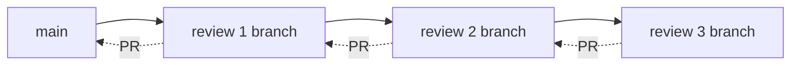

# gauntlet design

The Go implementation of gauntlet: run 54 specialized review prompts through installed
AI coding agents, which apply fixes directly to the working tree.

The Python original is a single 2700-line sequential script. This port keeps
the original's prompt semantics, and changes five things: reviews can run
in parallel with git-level isolation, agent output is normalized into
structured events instead of raw bytes, every run is journaled, and the binary
can replace and reload itself while a loop is running; an ordered pass can
also publish its changes as a linear, unmerged PR stack.

## Goals

1. Same review semantics as the Python original: same prompts, same injected
   rules, same containment, same exit codes.
2. Parallel where it is safe: across directories always, and inside one
   directory only with isolated lane worktrees and a merge step.
3. A dashboard that reads like an instrument, not a log tail.
4. Fast: sub-100ms to first useful output, no measurable runner overhead
   against agent wall time.
5. One static binary that can update and reload itself.

## Non-goals

- Sandboxing the agents. Containment is prompt-level and process-level
  (new session, no stdin, hard timeout), exactly as in the original. Running
  untrusted repos still means running them in a container.
- Reimplementing agent CLIs. The runner is a scheduler and a screen.

## Package layout

| Package | Responsibility |
|---|---|
| `cmd/gauntlet` | flag parsing, mode dispatch, exit codes, the help screen (`help.go` and its `help_*` build-tag half), the per-run preflight steps, and the plain reporter |
| `cmd/sbom` | the release-time command `make release` runs to write the CycloneDX inventory of the built binaries |
| `internal/agent` | agent specs, PATH resolution, command construction, doctor inventory, custom definitions from `agents.json` in the state root, the usage-counter patterns in `usage.go`, and the display truncation it shares with `internal/normalize` |
| `internal/prompt` | embedded prompts, project prompt discovery, sets, composition |
| `internal/evidence` | the file-signal suggester: the reviews a tree's own files, changelog, and past runs justify, read off disk with no agent and no tokens |
| `internal/normalize` | agent output noise reduction and line classification, and in `display.go` the sanitize, home redaction, and clipping every untrusted string shown to a reader goes through |
| `internal/gitx` | the repo handle and its baseline (`gitx.go`), hardened git invocation and the safe config overlay (`exec.go`), worktree line stats (`stats.go`), status and diff porcelain parsing (`status.go`), and the tree listing (`list.go`); worktrees, branches, and snapshots in `worktree.go`, `branch.go`, and `snapshot.go` |
| `internal/ghx` | bounded, argv-only GitHub PR discovery and creation through `gh` |
| `internal/runx` | process-group kill, WaitDelay, and capped stdout/stderr for every child |
| `internal/runner` | scheduler, worktrees, timeouts, lock, commit step, events; transcript usage in `usage.go`, with the reader picked by `usage_toktop.go` / `usage_off.go` under `-tags notoktop` |
| `internal/journal` | the JSONL run log under `~/.gauntlet`: the journals, the index rebuilt from them, the `pruned/` quarantine, and the read-only `Inspect` doctor reads |
| `internal/gauntlethome` | the one resolver of the state root (`GAUNTLET_HOME`, else `~/.gauntlet`) and of the `state/` subdirectory the reload handoffs live in, shared by the journal, the agent definitions, and the reload handoff, plus the durable-write helpers (`SyncDir`, `SweepStaleTemps`, `NewTempFile`) every temp-file writer needs. `SweepStaleTemps` takes the clock its age cutoff is measured against, so the same state swept at two times is swept the same way, and `NewTempFile` takes the one prefix a writer used to spell twice, once to sweep under and once to create under |
| `internal/streamjson` | envelope-agnostic parser for agents' machine-readable output |
| `internal/ui` | bubbletea dashboard, and the `pick` launcher in `pick.go` |
| `internal/selfupdate` | release check, verified download, atomic replace, re-exec |
| `internal/sbom` | the CycloneDX inventory of a release, read out of the built binaries' build info |
| `internal/humanize` | one reader and formatter for durations and counts, shared by all of them |
| `internal/envx` | one reader for the boolean environment variables, so the documented list of values that mean off is written once |
| `internal/fuzzy` | the one place a name is put in comparable form (NFC, case folding, the ASCII fast path), and the typo-tolerant match behind every "did you mean" hint |

Dependency direction is strictly downward: `runner` imports `agent`,
`evidence`, `prompt`, `normalize`, `gitx`, `ghx`, `runx`, `streamjson`, and
`humanize`; `evidence` imports `fuzzy`, `gitx`, `journal`, and `prompt`, so the
file-signal suggester reaches the tree, the run history, and the catalog
without any of them reaching back;
`gitx`, `ghx`, `agent`, and `sbom` import `runx` for the shared child
kill and output cap; `ui` imports
`runner`'s event types plus the shared `normalize` line kinds, `humanize`
formatters, the `envx` boolean reader, which the motion-off variables go
through for the same reason `cmd/gauntlet` does, and the `fuzzy` fold behind
the picker's filter, and nothing else. The picker takes the file-signal suggester name from `PickConfig`
rather than importing `evidence` for it. `cmd/gauntlet` and `ui` import `envx`,
the one reader of the boolean environment variables, so the one list of
values that mean off, which `docs/CLI.md` states once for all five variables,
is written once: the plain reporter and the dashboard ask the same package
rather than each keeping a copy of the rule. `prompt` imports `gitx`, so project
discovery's listing (`ls-files` for `*-review.md`) and ignore check use the
same hardened resolver and safe config as every other git invocation,
`normalize` so catalog and summary clips use the same rune-bounded ellipsis,
and `humanize` so composed prompts spell timeouts the same way the rest of
the binary does. `agent`
and `prompt` import `fuzzy`, so a
mistyped review or agent name gets the same suggestion everywhere; the CLI
uses it for unknown commands and flags too. `journal` imports `humanize`, so
the one reader of the persisted `elapsed_s` field is the one that renders it,
and the run listing, the headless reporter, and the dashboard cannot disagree
about what a run's duration is.
`agent`, `journal`, `selfupdate`, and `cmd/gauntlet` import `gauntlethome`: the
first two for the one resolver of the state root, the CLI for the same resolver
and the `state/` subdirectory it hands a reload off through, the last for the
durable-write helpers
that keep an atomic replace, a stale-temp sweep, or the reload handoff from
tearing, the same durable directory flush the journal's own rename-based
writes need. `selfupdate` hands a run off through a file in that root and
fsyncs the directory with the same helper. `gauntlethome` imports nothing, so
the direction stays downward. Nothing inside `internal/` imports `ui`, so the
loop runs headless with zero TUI cost. `cmd/gauntlet` pins this graph.

## External dependencies

Seven direct modules, plus the modules they pull in. The default is no
new dependency: each row earns its place by doing something the standard
library cannot, and each was kept small on purpose.

| Module | Why it exists | Contained by |
|---|---|---|
| `charmbracelet/bubbletea` | dashboard event loop | imported by `internal/ui` only |
| `charmbracelet/lipgloss` | dashboard styling and adaptive color pairs | imported by `internal/ui` only |
| `muesli/termenv` | color-profile control for `--no-color`; lipgloss v1's profile API takes a termenv profile, so setting it means importing the type | `internal/ui.SetMonochrome` only |
| `maci0/toktop` | transcript token counts for agents that print none | `usage_toktop.go` in `internal/runner` and `transcript_toktop.go` in `cmd/gauntlet` only; build tag `-tags notoktop` drops both |
| `rivo/uniseg` | grapheme-cluster width, truncation, and segmentation so CJK and emoji remain intact and aligned | display paths in `internal/ui`, the plain reporter in `cmd/gauntlet`, and text truncation in `internal/agent` and `internal/normalize` |
| `golang.org/x/text` | NFC normalization under fuzzy matching, prompt-name handling, the picker's filter, the file-signal suggester, and the reload handoff's directory key | `cmd/gauntlet`, `internal/evidence`, `internal/fuzzy`, `internal/prompt`, `internal/runner`, `internal/ui` |
| `golang.org/x/term` | terminal detection and size before the TUI starts | `cmd/gauntlet` only |

No direct module is imported outside the column above, and no module is
imported without a row: `TestDirectModuleImportSites` and
`TestDesignDocumentsLinkedModules` hold both halves. The tables below are
the rest of what a release links in, none of it adopted and none of it
imported by name here. `TestLinkedModuleLicenses` reads the LICENSE file of
every row, so an upgrade that changes a license fails before it ships.

| Module | Why it links | Reached through |
|---|---|---|
| `charmbracelet/colorprofile` | maps a terminal profile onto lipgloss's renderer | `lipgloss`, `termenv` |
| `charmbracelet/x/ansi` | ANSI and SGR parsing for the styled dashboard output | `lipgloss`, `bubbletea` |
| `charmbracelet/x/cellbuf` | screen buffer and damage tracking behind `bubbletea`'s renderer | `bubbletea` |
| `charmbracelet/x/term` | terminal queries and the OSC 52 clipboard `bubbletea` exposes | `bubbletea` |
| `aymanbagabas/go-osc52/v2` | writes the OSC 52 sequence above | `charmbracelet/x/term` |
| `lucasb-eyer/go-colorful` | color-space conversion for lipgloss's adaptive pairs | `lipgloss` |
| `mattn/go-runewidth` | column width for the dashboard's tables | `bubbletea` |
| `mattn/go-isatty` | is-this-a-terminal checks behind the raw-mode switch | `termenv`, `golang.org/x/term` |
| `muesli/ansi` | ANSI writer the cell buffer emits its updates through | `charmbracelet/x/cellbuf` |
| `muesli/cancelreader` | interruptible reads so a repaint never eats a keystroke | `bubbletea` |
| `xo/terminfo` | terminal capability database behind termenv's profiles | `termenv` |
| `golang.org/x/sys` | the `ioctl` and terminal calls the standard library does not wrap | `x/term`, `isatty` |
| `klauspost/compress` | zstd decoder for dsh concatenated session logs | `toktop/agentusage`; `-tags notoktop` drops it |
| `modernc.org/sqlite` | crush/opencode keep counters in databases, not transcripts | `toktop`; `TAGS=` builds drop it; pure Go, so `CGO_ENABLED=0` cross-compilation is unaffected |
| `modernc.org/libc` | the cgo-free libc the pure-Go SQLite driver is built on | `modernc.org/sqlite` |
| `modernc.org/memory` | the allocator `libc` hands out | `modernc.org/libc` |
| `modernc.org/mathutil` | bit helpers for the big-integer arithmetic in `libc` | `modernc.org/libc` |
| `remyoudompheng/bigfft` | the transform behind the arbitrary-precision math in `libc` | `modernc.org/libc` |
| `ncruces/go-strftime` | the strftime the pure-Go `libc` provides itself where it cannot call the platform's C library, so the darwin build links it | `modernc.org/libc` |
| `dustin/go-humanize` | byte and time formatting inside toktop's transcript parsing | `toktop`; `-tags notoktop` drops it |
| `google/uuid` | session identifiers toktop uses to key a transcript | `toktop`; `-tags notoktop` drops it |

`go.mod` also requires `erikgeiser/coninput` and `mattn/go-localereader`, and
no shipped build links them: both are imported by bubbletea's
`key_windows.go`, and no release target is Windows. `go mod tidy` resolves
imports for every build configuration, including GOOS=windows, so a POSIX-only
release keeps two requires and compiles neither. They stay pinned and hashed
in `go.sum`, and no package in a released binary comes from them. The
inventory is the union over the platforms a release ships, not over the host
that reads it: `ncruces/go-strftime` links in the darwin build and not in the
Linux one, so `cmd/gauntlet/deps_test.go` resolves every target the dist
target publishes, and a row for either platform is never read as stale on the
other.

What the hand-rolled packages replace: `humanize`, `streamjson`, and `fuzzy`
exist because a general library for each would cost more in weight and
supply-chain surface than the few hundred lines they stand in for.

Supply-chain posture, and what any new dependency inherits as obligations:

- Every module is pinned to an exact version and verified against `go.sum`
  at build time. GitHub Actions are pinned by commit SHA, not tag.
  Runner images are pinned (`ubuntu-24.04`, `macos-15`), not `-latest`.
- Each release ships `checksums.txt` (the contract `gauntlet update` verifies
  downloads against) and `sbom.json`, a CycloneDX 1.5 inventory of the
  modules the released binaries link, each with its `go.sum` hash and the
  SPDX identifier of the license it ships. It is generated by `cmd/sbom`
  with the standard library alone, from the build info already inside each
  binary and the grant files in the module cache the build just filled, so
  the artifact describing the dependency surface adds nothing to it. The
  serial number is derived from the contents rather than drawn at random, so
  a rebuild produces the same document. A module whose license is not
  resolved carries no `licenses` field, and `cmd/sbom` names it on stderr
  rather than guessing one.
- Every release also publishes a build-provenance attestation per binary
  (`actions/attest-build-provenance`, pinned by commit SHA, over the entries
  in `checksums.txt`), so a consumer can check with `gh attestation verify`
  which workflow and commit built what they downloaded. `gauntlet update`
  does not read it, which is R2 in `docs/THREAT_MODEL.md`.
- `go mod tidy -diff` runs as part of `make check`: a module left behind by
  a replacement is still downloaded and still hashed on every build, and
  nothing else notices one.
- A scheduled `govulncheck` job, plus one on every `go.mod`/`go.sum` change,
  reports vulnerabilities reachable from this code; dependabot owns version
  bumps, the scan owns advisories. Dependabot groups minor and patch bumps
  into one pull request and leaves a major version in its own, for the
  modules and for the actions alike, so neither pass is ever riding along
  with a routine bump. The tool versions the workflows name inside a `run:`
  step are not dependabot's to track, and each is pinned in the Makefile and
  in the workflow that runs it, with a test holding the two equal.
- Licenses of every linked module are MIT or BSD-3-Clause, compatible with
  this repo's AGPL-3.0-or-later. `TestLinkedModuleLicenses` reads the
  LICENSE file of every module a shipped build links, transitive ones
  included, so a version bump that changes a license fails the suite.
- The sqlite driver tracks upstream SQLite closely; when auditing, read the
  `SQLITE_VERSION` constant in its `lib/sqlite.go`. Gauntlet only runs
  self-constructed queries against agent-owned database files, never SQL
  from untrusted input.
- Major versions of the Charm stack (bubbletea/lipgloss v2, February 2026)
  are adopted through a dedicated migration pass, never a drive-by bump:
  the v2 View API changes wholesale, and the v1 line continues to receive
  fixes in the meantime.

## Concurrency model

Two agents editing one working tree corrupt each other's work: one rewrites a
file the other is mid-way through fixing, one's verification run sees the
other's half-applied change, and neither diff is attributable afterwards. So
the unit of safe parallelism is **the directory**, not the agent.

```
--dirs ~/a ~/b ~/c
    ┌─ worker(~/a) ─ lock ─ sequential loop over reviews ─┐
    ├─ worker(~/b) ─ lock ─ sequential loop over reviews ─┼─► events
    └─ worker(~/c) ─ lock ─ sequential loop over reviews ─┘
```

- One worker per target directory, each with its own `.gauntlet.lock`, git
  baseline, review queue, and lane of the event stream. This is where the
  parallelism lives, and it is always safe: distinct trees, distinct agents.
- Inside one directory, reviews run **one at a time** by default, exactly as
  the Python original does, editing the working tree in place.
- `--jobs N` (N > 1) turns on **isolated parallel reviews**, described below.
- `--stacked-prs` turns on an **isolated sequential stack**, described below.
- A review that fails to launch or exits non-zero is retried on the same
  agent (`--retries`, default 2), then on further agents until the pool is
  exhausted. Timeouts are not retried. Each retry starts from the same
  files the first attempt saw: an isolated review resets its worktree to
  the base commit, an in-place review restores a snapshot of the working
  tree (including the user's uncommitted files) taken before the attempt.
  A missing snapshot or failed restoration blocks both retries and agent
  fallback rather than applying another attempt to unknown state.
  The runtime budget is checked before retry or fallback and again after
  backoff, before restoring the tree for another attempt.
- Cancellation is a `context.Context` per review, plus process-group kill
  (SIGTERM, then SIGKILL after 10s) exactly as the original.
- One event bus fans out to a buffered channel per subscriber: the logger,
  the journal, and the TUI. Output and live usage ticks may be dropped when a
  subscriber's buffer is full; all other events block until delivered, so
  subscribers must keep draining until the bus closes.
- The event bus carries an injectable clock (`Bus.Now`). Event timestamps,
  review and loop elapsed times, the `--runtime` budget, and a zero `--seed`
  all read it, so a test that pins the clock also pins those. The run's
  effective seed is resolved once, where the run's start instant is read
  (`runner.SeedOrClock`), and that one number is what the suggest step's
  agent order and the schedule's shuffles both draw from: a derived seed
  read twice would hand the two consumers different numbers, and the seed
  the journal prints would replay only the schedule. A hot reload carries
  the seed in its handoff, so a successor finishes the run from the seed the
  journal already recorded rather than a fresh one. Stochastic
  choices (shuffle, agent pick, backoff jitter) are keyed draws from the
  seed, not a shared random stream, so a recorded seed replays them even
  when `--jobs` interleaves lanes. The line-sample debounce reads the same
  clock through `gitx.Repo.Now`, wired from the bus, because it decides
  whether a sample is a fresh walk or a cached value and therefore which
  review a diff is attributed to. The clock reaches the display side the
  same way (`ui.Config.Now`, `reporter.now`, both handed `bus.Clock()`), so
  the dashboard's first reading, its end-of-run stamp, and a log line the
  bus could not stamp are the run's clock and not a second wall clock
  beside it. Production sets that clock once, at the bus, from the run's
  start instant and the monotonic reading, so every reader inside the run
  shares one handle and an NTP step cannot expire or extend `--runtime`;
  a caller that replays a run replaces the handle instead of each reader
  reaching for the wall clock. The one wait on the review path, the pause
  between two attempts of a failed review, is the matching seam
  (`Bus.Sleep`): its length is already a keyed draw from the seed, so with
  the wait injected a replay spends simulated time rather than the backoff
  the seed chose. Results are reported in review-name
  order, not lane completion order, so a replayed seed prints the same
  report. Every git invocation runs with `LC_ALL=C`, because git translates
  its own output and that output reaches the journal and the error a failed
  review reports: without it a machine set to a translated locale records
  different bytes for the same run than a CI machine does.
  `internal/runner/seed_test.go` replays a whole seeded run against itself
  and diffs every event field, which is what the seed is worth; a field that
  differs names the source that leaked.

### Isolated parallel reviews (`--jobs N`)

Concurrent agents in one working tree corrupt each other, so the runner does
not allow it. Parallelism inside a directory is granted only with isolation:
N persistent lane worktrees share one queue, split across the lanes up front.
Each review still gets its own branch; the lane directory stays put so later
reviews in that lane reuse the agent's prompt cache (see below).

```
baseline commit
   ├── git worktree add  lane-0   .gauntlet/worktrees/<run>-l<loop>-lane-0
   ├── git worktree add  lane-1   .gauntlet/worktrees/<run>-l<loop>-lane-1
   └── git worktree add  lane-2   .gauntlet/worktrees/<run>-l<loop>-lane-2
         N agents run concurrently, each in a stable checkout
         scheduled review i runs in lane i%N
   ↓
   one commit per review (runner-authored, no AI attribution)
   ↓
   serialized merge --squash back into the original branch
   ↓
   the lane advances to the new tip and starts the next review
```

Rules the runner enforces:

1. **Git required, tree clean of tracked changes.** A branch is cut from a
   commit, so uncommitted edits to files git knows about would be invisible
   to every review and then collide with the merges. Untracked files do not
   block the run. The runner returns `ErrDirtyTree`; the CLI may offer to
   commit first rather than only naming the error.
2. **N persistent lane worktrees**, under `.gauntlet/worktrees/`, added to
   `.git/info/exclude` so the checkouts never appear as untracked files.
   The loop's schedule is split across the lanes when it is built: review `i`
   of the schedule runs in lane `i%N`, so which lane a review lands in (and
   therefore its branch name and worktree path) is a function of the seed
   rather than of which lane's goroutine the OS scheduler woke first. Each
   review still gets its own branch; a lane that finishes one starts the
   next one assigned to it, from the current tip. A lane with one slow
   review cannot take the tail of another lane's list, so the loop ends when
   the slowest lane's last review does.
3. **The runner commits, not the agent.** Agents remain forbidden to run git
   (unchanged containment). After a review, the runner stages and commits its
   worktree in one commit. Nothing to commit means nothing merged.
4. **Merges are serialized** on the main tree, in completion order. A
   conflicting merge goes to the conflict step (below) and, if that does not
   land it, is aborted with its branch kept, named after the review, so the
   work can be inspected or merged by hand. Conflicts are reported as their
   own outcome in the summary and the journal, never silently dropped. The
   lock covers git, not the reporting: the merge step holds its log lines back
   and publishes them once the lock is free, because a log line is a blocking
   publish and a stalled subscriber would otherwise park every lane.
5. **Cleanup on the way out**: lane worktrees removed, merged review branches
   deleted, `git worktree prune` run. Unmerged branches survive on purpose.
   A run also sweeps the worktree root at startup, while it holds the run
   lock for that directory: the lane checkouts are full copies of the tree,
   and a run killed before this step skipped its own, which
   `CleanWorktreeRoot`'s `os.Remove` then refuses to clear.
6. Per-review line stats come from the review's own commit, so they stay
   exact under parallelism (unlike a shared-tree diff, which cannot be
   attributed).
7. `--commit`/`--push` still forces a quiescent point: all lanes drain and
   merge before the commit step runs.
8. **Each review's branch is cut from the current tip**, not from the loop's
   starting commit: after a merge the lane advances to that tip, and a stale
   base would turn every later merge in a loop into a conflict.
9. **The conflict step** (`--resolve-conflicts`, on by default) replays a
   refused branch into a scratch checkout of the tip, hands the marked files
   to one agent launch, and merges what comes back. It runs under the merge
   lock, so the tip is fixed for its duration; it commits nothing that still
   carries conflict markers; and every failure path leaves exactly what a
   plain conflict leaves. The marker scan covers every path the commit would
   contain, which `git add -A` makes the whole checkout, not only the files
   git reported as conflicted. The prompt names only the conflicted files and
   forbids git, like every other agent this tool launches. A conflict with
   more files than the prompt will name, or with no path safe to put in the
   prompt, is left for a human instead of launching. The lane then advances
   without deleting the kept branch.

### Isolated stacked pull requests (`--stacked-prs`)

Stack mode separates three decisions that parallel mode couples: reviews are
sequential, execution is isolated from the original checkout, and publication
opens PRs instead of merging branches. One worktree advances through the
selected review order for a pass. A changed review contributes exactly one
commit and becomes the base of the next changed review. `--max-loops` (default
1; 0 is unlimited) starts each later pass in a fresh worktree cut from the
previous pass's last published tip, so already-applied fixes stay in the tree.
In stack mode an explicit `-n 0` asks for unlimited passes.


```mermaid
flowchart LR
    M[main] --> B1[review 1 branch]
    B1 --> B2[review 2 branch]
    B2 --> B3[review 3 branch]
    B1 -. PR .-> M
    B2 -. PR .-> B1
    B3 -. PR .-> B2
```

The invariants are:

1. The initial commit is fetched directly from the selected remote base,
   once per logical run: a hot reload hands the pinned commit to its
   successor rather than fetching a tip that may have advanced. Every later
   branch is a direct, one-commit child of the preceding changed layer. No
   local branch needs to point at that commit.
2. The original worktree is read only to surface files the stack will exclude.
   Dirty files require interactive consent or `--yes` before the fetch;
   prompt discovery and suggestion signals read a snapshot of the fetched
   base; agents, staging, commits, and retry resets operate inside the
   scratch worktree.
3. A layer is not eligible as the next base until its push succeeds and an
   exact head/base PR exists. Publication failure therefore stops scheduling.
4. No-change and exhausted agent failures reset and delete their unpublished
   layer, leaving the preceding successful layer as the next base.
5. A published branch name derives from the review position, the review name,
   (after the first `--max-loops` pass) the pass number, and a topic slug taken
   from the layer's commit subject. The provisional `-wip-` branch a layer
   starts on carries a fragment of the base object id, and a published name
   that is already taken locally or on the remote gets the same fragment
   appended, so a rename never lands on a branch that is not its own.
   Existing branches and PRs are checked before an agent starts, which makes
   hot reload and repeated invocation convergent. A `gh pr create` that fails
   after GitHub accepted it is recovered by that same head/base lookup, so a
   lost response does not open a second PR or stop a published layer.
6. The worktree is disposable; local and remote branches are durable because
   they are the graph open PRs refer to. Nothing in this mode calls merge.
   A later pass discards the previous worktree and cuts a new one from the
   last published tip rather than re-fetching `--pr-base`.

### API-level cache reuse across reviews

Agents backed by the Anthropic API (Claude) cache the rendered prompt prefix
server-side: tools, system prompt, and the leading message history. A second
request whose prefix is byte-identical reads the cached tokens at roughly a
tenth of the input price. The cache entry lives for five minutes from the last
read, so sequential requests that share a prefix keep it warm indefinitely.

**Sequential mode (`--jobs 1`) gets this for free.** Every review launches in
the same directory. Claude Code builds the same system prompt (same CLAUDE.md,
same `Primary working directory:` path, same tool list), so review 1 warms the
cache and reviews 2-N read it. The review-specific text is the user message,
which sits after the cached system prefix and does not invalidate it.

**Parallel mode (`--jobs N`) mitigates it with persistent lanes.** Instead of
creating a throwaway worktree per review, parallel mode creates N stable lane
worktrees at loop start (branch slug `lane-0`, `lane-1`, ..., checked out under
`.gauntlet/worktrees/<run-id>-l<loop>-lane-<N>`) and splits the loop's
schedule across them. Within a lane, reviews run sequentially in the same directory, so
reviews 2..M in lane K all hit the cache that review 1 warmed. Across lanes,
the N worktrees still have N distinct paths, so each lane pays one cold start.
Cache cold starts scale with the lane count (N), not the review count.

For a 15-review run with `--jobs 3`: 3 cold starts and 12 cache hits, compared
to 15 cold starts and 0 hits with per-review worktrees.

Stacked-PR mode already uses a single worktree advanced through the review
order, so it gets the same cache reuse as `--jobs 1`.

The remaining cost is N cold starts (one per lane) rather than zero. Fewer
lanes means more cache reuse at the expense of wall-clock time. `--jobs 1`
is the degenerate case: one lane, maximum reuse, zero parallelism.

This is not Claude-specific. Every supported agent but one embeds the working
directory in its system prompt, so worktree mode defeats API-level caching
universally:

| Agent | Provider caching | CWD in system prompt | Worktree impact |
|---|---|---|---|
| Claude | Automatic prefix match, 5-min TTL, 90% discount on reads | `Primary working directory: /path/…` | Full miss per worktree |
| Gemini | Implicit on 2.5+/3, 90% discount, min 1024-2048 tokens | GEMINI.md resolved relative to CWD | Full miss per worktree |
| Codex | Automatic prefix caching (OpenAI) | Sandbox/directory config from CWD, AGENTS.md aggregated | Full miss per worktree |
| Grok | Automatic, routing-dependent (`x-grok-conv-id` header) | Working directory context embedded | Full miss per worktree; routing makes sequential hits unreliable too |
| Qwen | Anthropic-style `cache_control` markers, 5-min TTL | QWEN.md resolved relative to CWD (forked from Gemini CLI) | Full miss per worktree |
| Kimi | Automatic, ~10-20% of input cost on hit | Project context resolved from CWD | Full miss per worktree |
| Cursor Agent | Inherits provider caching (GPT, Claude, etc.) | `.cursor/rules` and workspace root from CWD | Full miss per worktree |
| OpenCode | Anthropic-style `cache_control` when using Claude | Project context from CWD | Full miss per worktree |
| dsh | Undocumented (DeepSeek API) | YAML config and profile from CWD | Likely same |
| agy, crush, clanker | Undocumented | Likely embed CWD | Likely same |
| microagent | Inherits the provider's caching (OpenAI-compatible) | None: the system prompt is a fixed string, and the tools take the process CWD | No miss per worktree: no request it sends names the working tree |

Gauntlet does not call any API directly, so it cannot place cache-control
breakpoints or send warmup requests. What it controls is launch ordering and
directory layout, which is what determines whether the agent's own caching
can engage.

## Speed

Agent wall time dominates by three orders of magnitude, so "fast" means the
runner never adds to it and never makes the user wait to see state.

- **Prompts are embedded** (`go:embed`), so the bundled set costs no syscalls
  and no prompt directory has to exist. Project prompt discovery asks git for
  `*-review.md` by basename glob rather than walking the tree, then filters
  generated and hidden directories the same way the walk would. The walk is
  the fallback when git is missing or the directory is not a repository;
  ignored files are still refused by one batched `check-ignore`.
- **PATH resolution is memoized** per process. The original ran `shutil.which`
  repeatedly; `doctor` alone did hundreds of stat calls serially. Here the
  inventory probes every candidate binary in parallel with a bounded pool.
  One function states the rule every executable is resolved under
  (`runx.AbsPATH`): relative and cwd-relative entries are dropped, and a
  process handed no `PATH` at all (launchd, systemd, `env -i`) searches
  `$HOME/.local/bin` and the fixed system prefixes instead. Agents, git, `gh`,
  and the usage probe go through it, so a box that finds its agent CLI also
  finds the git that drives it.
- **Git stats are sampled, not polled per review.** One `git diff --shortstat`
  and one `ls-files -o` per sample, run together, shared by all lanes behind a
  mutex, with a minimum interval between samples. The file-signal scan stops
  listing at a hundred thousand paths so a larger tree does not stay in memory.
- **Output is streamed, never buffered whole.** Each lane reads into a fixed
  ring (64 KiB tail for token parsing) and pushes normalized lines onward.
  Nothing accumulates per-review output in memory.
- **The TUI redraws on a fixed tick**, 10 fps, and renders only the rows
  that fit. Braille charts precompute their style cache per frame.
- Startup does no network I/O. Update checks are explicit or run in the
  background, never on the critical path to the first review.

## Output normalization

Agent CLIs are chatty and terminal-oriented. The original stripped ANSI codes,
dropped spinner frames, and collapsed repeated progress verbs. This port keeps
that and adds what a dashboard needs:

1. Strip CSI/OSC/DEC escapes and control characters; honor `\r` by keeping
   only the last segment of a rewritten line (that is what the terminal would
   have shown).
2. Drop lines that carry no information: empty, spinner-only, box-drawing-only.
3. Collapse consecutive duplicates into one line with a repeat count.
4. Collapse consecutive progress lines of the same verb, as the original did.
5. Rate-limit per lane. A burst beyond the cap is summarized
   (`… N lines suppressed`) rather than flooding the feed.
6. Strip the decorative left gutter agents draw down their tool output
   (`|` for opencode, `⏺`/`⎿` for claude, `•` for codex) and judge what is
   left, so a gutter line with nothing after it disappears while its content
   survives. A pipe inside a command is not a gutter and is left alone.
7. Classify each surviving line as `plain`, `tool`, `error`, `progress`,
   `result`, a unified-diff line, or model reasoning, so the dashboard can
   color it and the summary can pick out `RESULT:` lines without a second
   pass.
8. Read token counters out of the stream as they go, and publish a usage event
   whenever the number grows. That is what makes the dashboard's tok/s a
   measurement rather than an average computed at the end. Agents that report
   nothing produce no rate, never a guess.

Normalization is pure and table-tested. `--raw` bypasses the classification,
collapsing, and rate limiting, but not the safety floor: every line that
reaches a terminal or log passes through `normalize.Display`, which strips
escapes and control characters while leaving visible text alone. Agent output
is untrusted, so no mode echoes it byte-for-byte. Stream events (thinking
lines) get the same treatment at `emitStream`, plus the length cap.

## Self-update and hot reload

Two separate mechanisms that compose:

**Self-update** (`gauntlet update`, or `--auto-update` checking in the
background during a long run) fetches the latest release for this `GOOS/GOARCH`,
verifies its SHA-256 against the release's `checksums.txt`, writes it next to
the current binary, and renames it into place atomically. A failed
verification leaves the running binary untouched. The binary the rename
replaces is copied to `<binary>.previous` first, atomically and with its mode
and directory entry made durable, so the one step an update cannot undo has a
way back: renaming that copy over the new binary restores the version before
it. A copy that cannot be written aborts the update instead. Nothing is
executed from
the download before verification. Every release also ships `sbom.json`, a
CycloneDX inventory produced by `cmd/sbom` over each built binary's own build
info: anyone auditing a release can read which module versions, hashes, and
licenses shipped without rebuilding it, and a vulnerability scanner can read
the file
without a tool from this repository. The binaries themselves are
bit-reproducible: `-trimpath`
strips build paths, `-buildvcs=false` keeps git metadata (revision, commit
time, dirty flag) out, and nothing embeds a timestamp, so the same source
built from a clone, a source tarball, or a dirty tree — in a different
directory, under a different locale and timezone — yields identical bytes.
Builds pass `-mod=readonly`, so a missing or extra module fails the command
instead of rewriting go.mod or go.sum, make exports `GOWORK=off`, so an
ambient go.work above the checkout cannot add its modules or replace
directives to the build, and `GOTOOLCHAIN=local` pins compilation to the
installed toolchain rather than downloading compiler releases from the network.
Make also exports `GOAMD64=v1` and `GOARM64=v8.0`, so ambient CPU settings
cannot raise the minimum processor requirements of release binaries.
The one input that cannot be normalized is the toolchain: a binary records
the compiler version, and the `go` line in `go.mod` is a language minimum, not
the release that ships. So the exact Go release is pinned once, in the
Makefile (`GO_VERSION`), every workflow installs exactly that one instead of
resolving the `go` line, and the targets whose bytes ship (`make dist`, and
`make repro` with it) refuse a toolchain the pin does not name. Rebuilding a
release byte-for-byte means the tag, a clean tree, and that Go release.
`make repro` proves the rest on every CI run by building twice and
comparing, for each platform in `PLATFORMS`; the second build strips the
locale the Makefile pins, so it runs under the host's ambient one.
The clean tree in that sentence is checked, not assumed: `make release`
refuses a working tree with an uncommitted or untracked change before it
builds anything, because `-buildvcs=false` leaves no revision and no dirty
flag in the bytes, so a release built from a modified tree would be
indistinguishable from the tag and would ship source no reviewer read. The
tagged release workflow writes its extracted notes under `dist/`, which is
gitignored, so the check does not trip on the job's own scratch file.
The version is claimed the same way: the tag names it, the workflow hands it
to `make release` as `VERSION`, and `make release` refuses the `dev` default a
local build uses, because a release built on that default would be complete
and self-consistent at a version no tag names (assets `gauntlet_dev_*`, a
binary reporting `gauntlet dev`, and a `make smoke` that compares the stamp
against the same placeholder).

**Hot reload** watches the running executable's inode, size, and mtime every
five seconds and requires two immediately consecutive identical readings
before acting (`internal/selfupdate/reload.go`, `Watcher.run`). Those readings
do not prove a write is complete: safe replacement depends on the writer
renaming a complete binary into place atomically, as self-update does.
When a replacement is detected, the swap proceeds like this:

1. Every runner is asked to stop softly. A soft stop never signals an agent:
   reviews in flight run to completion, including their commit, publication,
   and merge work.
2. Each directory's unfinished queue, results, loop count, and commit tallies
   are written to `state/<run-id>.json` under the state root, which is
   `~/.gauntlet` unless `GAUNTLET_HOME` says otherwise.
3. The journal is flushed and closed **without** an index row, and the
   directory locks are released.
4. `execve` replaces the process with the new binary, same pid and terminal,
   plus `GAUNTLET_STATE`. It receives the effective run arguments, not
   necessarily the original argv, so a launcher-composed run does not reopen
   the launcher and a suggested run does not repeat selection.
5. The successor seeds its stats from the handoff, resumes the interrupted
   loop from its remaining reviews, subtracts finished loops from
   `--max-loops`, keeps the original start time for `--runtime` and the
   run's RNG seed, and appends
   to the same journal file. An unreadable handoff is a hard failure: the
   successor exits rather than starting a fresh run that would repeat work.

The result is one run, one run id, one index row, one summary, spanning both
binaries. What a reload costs is latency: it waits for the reviews in flight,
which can take up to `--timeout`.

## Choosing reviews without an agent

`--suggest-agent gauntlet` answers the triage question from evidence on disk,
in milliseconds and for no tokens. What it collects in one pass:

- **What the tree is made of**, by count rather than presence. A language earns
  its reviews at three files or a twentieth of the tree, so one stray
  stylesheet in a Go repository is not a frontend.
- **What the files say inside.** The head of each source file (4 KB, up to
  2000 files) is searched for a fixed table of markers, one per capability it
  hints at (`net/http` and `fastapi` for http, `sqlalchemy` and `database/sql`
  for sql, `prometheus` and `otel` for telemetry, and further ones for clock,
  concurrency, cache, auth, unsafe, exec, model, cloud, retry, cli, tui,
  translate, recovery, and numeric). What a codebase imports is a fact about
  it; a directory name is a guess.
- **What is missing.** No tests, no documentation, no CI: absence is the
  strongest argument for the review that would fix it, and presence-only rules
  said the opposite.
- **What is alive.** `git log --since="90 days ago" --name-only` weights a
  language by whether anyone is still editing it. Without commit history the
  weighting is skipped rather than guessed.
- **What happened here before.** The journal already records each review's outcome
  per directory. A review that has finished here three times without changing
  a line is demoted; one that keeps landing changes is promoted. It is the only
  signal that improves with use.
- **What a prompt declares.** A `Signals:` line in a project's own review makes
  it reachable at all (see RUNS.md); the built-in rules only know built-in
  names.

Each rule contributes weight rather than a yes, the reviews are ranked by the
total, and what does not clear the floor is not proposed. The tree is listed by
`git ls-files --cached --others --exclude-standard` when there is a repository,
so tracked files and untracked files the project's ignore rules allow both count
as source; a plain walk with a skip list is the fallback.

`scripts/suggest-calibrate.py` scores the result against what agents picked in
past runs. It is a reference, not ground truth: several of these rules are
meant to diverge from a model's opinion.

## Run journal

Every run writes JSONL under `~/.gauntlet` (`GAUNTLET_HOME` overrides):

```
runs/YYYY-MM-DD/<run-id>.jsonl   the event stream, one JSON object per line
index.jsonl                      one summary line per finished run
pruned/YYYY-MM-DD/<run-id>.jsonl journals the --keep-runs bound moved out
.index.lock                      serializes index rebuilds and Close
state/<run-id>.json              hot-reload handoff, removed after pickup
```

Design points:

- The journal is **another subscriber to the same event bus** the dashboard
  reads. No separate instrumentation path exists to drift out of sync.
- The retention bound **moves** what it drops into `pruned/` rather than
  unlinking it, and the quarantine is bounded by the same `--keep-runs`. The
  prune fires unattended at the end of every run from a flag, so a run stays
  recoverable until the same number of newer runs has replaced it;
  `gauntlet runs --restore` moves one back. A quarantine bound by nothing would
  be a second unbounded history beside the one the bound exists to cap.
- A journal a run still has open is never moved, whatever the keep window says
  or whatever order its id gives it: the writer holds a shared `flock` on the
  stream it appends to and the prune takes an exclusive one, which fails while
  the run is writing, and the process records the streams it holds so the
  answer is the same on both platforms: a `flock` belongs to the open file
  description on Linux, so the prune's own descriptor conflicts, and to the
  process on macOS, where it would convert this process's own shared lock and
  call a live stream idle. Two gauntlet runs on the same state tree overlap easily,
  and the second one's prune would otherwise move the first one's live event
  stream into `pruned/`, leaving the row its `Close` appends naming a file the
  listing no longer holds. The skipped run keeps its index row in the same
  pass, so it still lists when it finishes.
- `Inspect` reads the tree for `gauntlet doctor`: journals on disk, index
  rows, runs the two copies tell apart, and pruned runs. A restore is checked
  against that rather than against the exit code of the run that wrote it.
- Date sharding keeps one directory listing small; the flat index makes "what
  did I run last week" a tail rather than a tree walk. A generated run id
  encodes that date, so looking one up is a stat of one file, not a probe of
  every shard. The listing, the keep bound, and the quarantine all order runs
  by that id, across the whole tree rather than by the shard a journal happens
  to sit in, and one id is one run: the same journal filed a second time is
  listed once, the copy in the shard the id names winning, so a duplicate
  cannot spend a slot of the keep window or print a run twice. A run id in no
  generated form is listed and pruned like any other, wherever it is filed.
  The order is not the text order: the fixed-width instant
  leads, and the process id after it is compared as the number it is, because
  the id writes it in unpadded hex (`1f4` for 500, `1f400` for 128000) and two
  runs started in the same second would otherwise order by pid width. The
  journals are the source of truth: a missing or empty index
  is rebuilt from them, and a stale one has every newer unindexed journal
  appended, so a crash that flushed the event stream still lists, and two
  such crashes in a row do not hide the older one. A crash behind a later
  Close is filled from its journal for that listing; appending it would
  make it the newest index row and hide the later Close's `args`.
  Reconstructed rows omit `args`, `exit_code`, and `elapsed_s`, which only
  `Close` records, so `exit_code` is a pointer: a plain zero would have told
  a listing that a run killed mid-review exited cleanly. The same reasoning
  gives `ins`/`del` a `lines_measured` flag, and the listing prints `n/a`
  rather than `+0/-0` for a run whose lines could not be attributed. An
  unrecognized terminal status reconciles into `other`, so every review a row
  counts lands in exactly one bucket and FAILED still explains the exit code. Index rebuilds and Close serialize on a sibling lock so
  a listing cannot overwrite a just-written summary. That lock is polled
  against a caller-supplied clock and pause (`lockIndex`), so a contended
  acquisition gives up after a fixed number of retries rather than after
  however long the real clock took. The listing prefers
  `elapsed_s` (monotonic) over End−Start so an NTP step cannot rewrite how
  long a run lasted.
- Agent output (`output` events) and the live usage ticks (`usage` events)
  are **not** journaled. They are large, they are reconstructible from the
  agents' own logs, and the results are what anyone reads later. Everything
  else is.
- Journaling is never load-bearing for a run in progress: a journal that
  cannot be opened degrades to a warning. A nil journal is a working no-op,
  so no caller branches on it.
- A hot reload appends to the same file and writes **one** index row, from the
  successor, covering the whole run.
- A closed run is **fsync'd**, and so is the directory that holds the index
  after a rebuild renames it into place. Flushing a buffer protects a run from
  a killed process; it does not protect the source of truth from a power cut,
  and syncing only the derived index would leave a listing that outlives the
  journal it is reconstructed from. The cost is one sync per run, not per
  event.
- The history is **bounded**: at the end of a run, `--keep-runs` (200 by
  default) drops the journals and index rows past the newest N, and a day
  directory left empty is removed. The index is compacted before the journals
  go, so a listing never names a run whose file is gone, and the run that just
  finished is the newest one and can never be the one dropped. A run in
  progress sorts above every run the prune can reach. `0` keeps everything.

## Dashboard

Follows the TMOG dashboard rules: a cockpit, not a report.

- The whole state fits one screen: lanes, review grid, throughput, feed.
- Live data is bright; grid, borders, panel names, and chrome stay dim.
- The wordmark is the path-arrow teal of the mark (`#0e96a8` on dark
  terminals, a darker pull of the same hue on light), one hue, distinct
  from the Catppuccin teal in the heat ramp and agent rotation.
- One hue per agent, used for its lane, its rows, and its trace everywhere.
- Colors adapt to the terminal's background: Catppuccin Latte on light
  terminals, Mocha on dark ones. The pairs are pinned by test to WCAG 2.2 AA:
  text at 4.5:1 (SC 1.4.3) and instrument strokes such as unlit meter
  segments and the chart baseline at 3:1 (SC 1.4.11). Borders are decorative
  and exempt. Keys, panel names, and other chrome stay at the dim/body
  styles; magenta is for diff hunk headers, lavender for reasoning, and the
  heat ramp for magnitude.
- Meters are quantized segments with a visible unlit remainder.
- A feed line says what it is in its own text wherever its text can: a diff
  carries the sign it was added or removed with, a result line carries
  `RESULT:`, reasoning is italic. An error the agent reported is the one
  kind its text does not identify, so it carries a `!` in the line's own
  style, named in the help overlay beside the review glyphs. Nothing the
  feed or the grid says depends on hue alone, which is what `--no-color`
  and a monochrome terminal leave behind.
- The throughput chart is braille (2x4 dots per cell) and hugs the right
  edge, with a current-value marker at the live end.
- Missing data shows as missing (`~`, `n/a`), never as zero or an interpolation.

## Trust model

Prompt reads, PATH stripping, display sanitization, and the directory lock are
the original's. Git invocation is stricter: a reviewed repository's config can
name programs, so the port blanks every execution-bearing key it can reach.

- Prompts are read with `O_NOFOLLOW`, size-capped, regular files only.
- Agent binaries resolve on a PATH with cwd-relative entries removed.
- Git runs with `core.fsmonitor`, `diff.external`, and `core.gitProxy` forced
  empty, `core.hooksPath=/dev/null`, `core.pager=cat`, `protocol.ext.allow=never`,
  `attr.tree` pointed at the empty tree so in-tree `.gitattributes` cannot
  select a smudge filter or merge driver, and local `filter.*`/`merge.*`/`diff.*`
  commands plus `core.editor`, `core.askpass`, and peers blanked from
  `--local --list`. `GIT_SSH_COMMAND=ssh` unless the operator already set it,
  so a hostile repo's config cannot execute code. Git's PATH is the same
  absolute-only list.
- Untrusted text (prompt names, descriptions, agent output) is sanitized of
  control and bidi-formatting characters before display.
- A `flock` on `.gauntlet.lock` prevents concurrent runs in one directory.
  The process also records the paths it holds, because `flock` alone does not
  refuse a second lock in one process on every platform: Linux ties a lock to
  the open file description and macOS to the process. Release clears the holder
  note but keeps the inode: unlinking it could leave
  an opener locking the old inode while another run locks a newly created one.
  Do not remove the file while runs can start.
